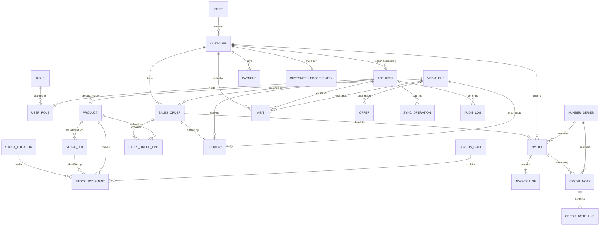

# DistriCore — Database Design

| Field | Value |
| --- | --- |
| Document ID | `04_Database_Design` |
| Version | 0.1.0 |
| Status | **Draft — requires sign-off before `0001_initial` is written** |
| Date | 2026-08-04 |
| Owner | Chief Systems Engineer |
| Scope | **Edition 1 (1a + 1b)** per `02A` §13 |
| Target | PostgreSQL 16 |
| Depends on | `00_Engineering_Foundation.md` v1.0.0 · `01` v0.2.0 · `02` v0.1.0 · `02A` v0.2.0 · `03` v0.1.0 |

> **This document is the design of the least reversible artefact in the project.** `0001_initial` establishes the shape every later migration inherits and every future row is written through. A missing column here is not a schema addition later — it is a migration of live financial history (Foundation §15.3, E-06).
>
> **No SQL, no Django models, no migrations are produced here.** Design only.

---

## 1. Design Principles

### 1.1 Governing rules inherited from the constitution

| # | Rule | Effect on this schema |
| --- | --- | --- |
| N-03 / E-01 | Balances are derived, never stored | `stock_movement` and `customer_ledger_entry` are the only sources of truth for quantity and money owed. **No `quantity_on_hand`, no `outstanding_balance` column exists anywhere** |
| N-04 / E-02 | Issued documents immutable | `invoice`, `invoice_line`, `credit_note`, `credit_note_line` have no update path. Correction is a new document |
| N-05 | Every stock movement is explained | Database `CHECK`: a source document **or** a reason code |
| N-07 | Money is exact | `NUMERIC(14,2)` money, `NUMERIC(14,3)` quantity, `NUMERIC(5,2)` percentages. **No `float`, no `double precision`, anywhere** |
| N-08 | UTC | Every timestamp is `timestamptz` |
| N-09 / E-05 | Schema-agnostic | No schema name in any object reference; every object creatable in an empty schema |
| N-10 / E-06 | Structural enablers | `stock_movement` carries `location_id` and `lot_id` from row one |
| ADR-007 | Schema-per-tenant | **No `tenant_id` column on any table** |

### 1.2 Design rules specific to this schema

| # | Rule | Why |
| --- | --- | --- |
| D-01 | **Minimum viable table count.** A table exists only where a confirmed Edition 1 requirement needs it | Every table is a migration, a service, a test surface and a thing to keep correct |
| D-02 | **Financial documents carry snapshots.** Invoices persist name, address, GSTIN, product name, HSN and rate as they were at issue | FR-BIL-008. A later price or address change must not rewrite financial history |
| D-03 | **Soft delete only** where history exists — `is_active`, never `DELETE` | FR-CUS-009, FR-PRD-009 |
| D-04 | **Owner-editable sets are tables; developer-controlled sets are `CHECK` constraints** | §1.4 |
| D-05 | **Every device-created row carries `client_uuid UNIQUE`** | BR-012, E-09 — idempotent sync |
| D-06 | **Foreign keys are declared and enforced in the database**, not only in the ORM | The database is the last line of defence against a service-layer bug |
| D-07 | **No nullable foreign key without a documented reason** | A nullable FK is an undocumented optional relationship |
| D-08 | Denormalisation is permitted only for **immutability** (D-02) or a **measured** performance need. Never for convenience | Denormalised data drifts |

### 1.3 Naming conventions

| Object | Convention | Example |
| --- | --- | --- |
| Table | `snake_case`, **singular** | `sales_order`, not `sales_orders` |
| Primary key | `id` | |
| Foreign key | `<referenced_table>_id` | `customer_id` |
| Boolean | `is_` / `has_` | `is_active` |
| Timestamp | `_at` | `created_at`, `issued_at` |
| Date (no time) | `_date` | `invoice_date` |
| Money | `_amount` | `total_amount` |
| Percentage | `_percent` | `tax_rate_percent` |
| Index | `ix_<table>_<cols>` | `ix_stock_movement_product_id` |
| Unique | `uq_<table>_<cols>` | `uq_customer_code` |
| Check | `ck_<table>_<rule>` | `ck_stock_movement_has_source` |

### 1.4 Enumerations — table or constraint?

The decision rule, applied consistently:

> **Can the business owner add a value without a developer? → lookup table. Does adding a value require code that understands it? → `CHECK` constraint.**

| Set | Kind | Why |
| --- | --- | --- |
| Reason codes | **Table** (`reason_code`) | The owner invents new reasons — "leakage", "rat damage", "sample". No code change needed |
| Zones | **Table** (`zone`) | Owner-maintained geography |
| Roles | **Table** (`role`) | Preserves EP-B custom roles; only 4 seeded |
| Payment method | `CHECK` | Each method may eventually need distinct handling (UPI reference, cheque clearing) |
| Order status | `CHECK` | Every status has code behaviour attached. A status the code does not know is a bug, not a feature |
| Movement type | `CHECK` | Same |
| Ledger entry type | `CHECK` | Same |

**Why not a generic `enum_value` table for all of them.** That is the entity-attribute-value trap: it removes type safety, removes foreign-key integrity, makes every query a join, and moves errors from schema time to runtime. Rejected under E-11.

**Why not PostgreSQL `ENUM` types.** Adding a value to a PG enum is a DDL operation with awkward transactional semantics, and removing one is effectively impossible. `VARCHAR` + `CHECK` gives identical safety with a one-line migration to extend. Deliberate.

### 1.5 Primary key strategy

### DBD-01 — `BIGINT GENERATED ALWAYS AS IDENTITY` surrogate keys, plus `client_uuid` where offline creation occurs

**Decision.** Every table has `id BIGINT GENERATED ALWAYS AS IDENTITY PRIMARY KEY`. Tables that can be created on an offline device additionally carry `client_uuid UUID NOT NULL UNIQUE`.

**Why.** Integer keys are compact, index efficiently, and cluster naturally by insertion order — which matters for the ledger and movement tables, the two that grow fastest and are almost always queried by recent range. The offline problem that UUIDs would solve is solved instead by `client_uuid`, which is exactly what BR-012 specifies: the client generates an idempotency key, the **server remains the authority on identity**. That separation is deliberate — it keeps the device from asserting facts about the server's namespace.

**Alternatives.** (a) UUIDv4 primary keys everywhere — index bloat and poor locality on the largest tables, for a benefit already obtained by `client_uuid`. (b) UUIDv7 primary keys — solves locality and is genuinely attractive; rejected for Edition 1 because it doubles key width on the two hottest tables to buy a property nothing currently needs. (c) Natural keys (invoice number as PK) — couples identity to a business value that has formatting rules and financial-year resets. (d) Composite keys — every child table inherits the width.

**Trade-offs.** Sequential integer IDs are enumerable. Mitigated because `RETAILER` access is scoped server-side on every request (N-06, BR-003), so guessing an ID grants nothing. If public IDs ever become a concern, the fix is exposing `client_uuid` or a slug in the API, not changing the primary key.

**Long-term impact.** At SaaS scale under schema-per-tenant (ADR-007), integer keys stay unique within a tenant schema, which is the only scope that matters.

**Migration cost if changed later.** **High** — changing primary key type rewrites every table and every foreign key. This is on the irreversible list (§9).

### 1.6 Type conventions

| Purpose | Type | Reason |
| --- | --- | --- |
| Surrogate key | `BIGINT` identity | DBD-01 |
| Money | `NUMERIC(14,2)` | N-07. Ceiling ≈ ₹999 crore — well beyond DR-8 |
| Quantity | `NUMERIC(14,3)` | Fractional units (kg, litre) without changing the schema later |
| Percentage | `NUMERIC(5,2)` | 0.00–999.99 |
| Timestamp | `TIMESTAMPTZ` | N-08 |
| Date | `DATE` | Invoice and order dates are calendar dates, not instants |
| Short code | `VARCHAR(32)` | |
| Name | `VARCHAR(200)` | |
| Free text | `TEXT` | No arbitrary limit where none exists in the business |
| Phone | `VARCHAR(20)` | Stores E.164 with room; validated in the service layer |
| GSTIN | `VARCHAR(15)` | Fixed statutory length |
| HSN | `VARCHAR(8)` | Statutory maximum |
| Coordinates | `NUMERIC(9,6)` | ~0.1 m precision; exact, unlike float |
| Structured payload | `JSONB` | Audit before/after only — never business data |
| Enumerated | `VARCHAR(20)` + `CHECK` | §1.4 |

> **`NUMERIC(9,6)` for GPS rather than `float8` or PostGIS.** Exact storage, no rounding surprises, and no extension dependency. PostGIS would be required for genuine geospatial queries — a route-optimisation concern (EP-N, Edition 3), not a "record where the salesman stood" concern.

---

## 2. Table Inventory

**27 tables.** Every one is justified against a confirmed Edition 1 requirement in §3–§8, and the requirement traceability is verified in §10.

### 2.1 By category

| Category | Count | Tables |
| --- | --: | --- |
| **Identity & access** | 4 | `app_user`, `role`, `user_role`, `otp_request` |
| **Configuration** | 2 | `business_profile`, `number_series` |
| **Lookup / owner-maintained** | 2 | `zone`, `reason_code` |
| **Structural (inventory dimensions)** | 2 | `stock_location`, `stock_lot` |
| **Core business — masters** | 2 | `customer`, `product` |
| **Core business — inventory** | 1 | `stock_movement` |
| **Core business — selling** | 3 | `sales_order`, `sales_order_line`, `delivery` |
| **Core business — billing** | 4 | `invoice`, `invoice_line`, `credit_note`, `credit_note_line` |
| **Core business — settlement** | 2 | `payment`, `customer_ledger_entry` |
| **Core business — field & marketing** | 2 | `visit`, `offer` |
| **Infrastructure** | 2 | `media_file`, `sync_operation` |
| **Audit** | 1 | `audit_log` |

### 2.2 Tables deliberately NOT created

Each was considered and rejected. Recording the rejection is as important as recording the design — it prevents the same table being proposed again in three months.

| Not created | Would have held | Why not | Arrives at |
| --- | --- | --- | --- |
| `price_list`, `price_list_item` | Multiple price lists | One price list. `product.selling_price` is that list (`02A` §13.2) | Edition 2 |
| `customer_price` | Per-retailer negotiated rates | **Client confirmed: same price for all shopkeepers.** Manual line discount covers exceptions | Edition 2 |
| `scheme`, `scheme_slab` | Automatic schemes | Automatic scheme calculation is Edition 2. V1 shows an owner-posted offer (`offer`) | Edition 2 |
| `unit_of_measure`, `uom_conversion` | N-level unit conversion | Replaced by `product.pack_size` — a single integer covers case↔piece (`02A` §13.2) | Edition 2 |
| `tax_code`, `tax_rate` | Effective-dated tax rates | `product.tax_rate_percent`, snapshotted onto the invoice (D-02). Changing a rate cannot alter history, so effective dating buys nothing in V1 | Edition 2 |
| `device` | Registered device records | Device registration demoted (`02A` §13.2). `device_id` survives as a **column** on sync-created rows, preserving the shape | Edition 2 |
| `notification` | In-app notifications | Module cut entirely (`02A` §13.2). An "unactioned orders" filter replaces it at zero cost | Edition 2 |
| `complaint` | Complaint tickets | V1 is a call button. Ticket logging is Edition 2 | Edition 2 |
| `purchase_order`, `goods_receipt`, `supplier` | Procurement | Stock enters via reason-coded `stock_movement` (DV-6) | Edition 2 |
| `sales_return`, `purchase_return` | Structured returns | Returns are a reason-coded movement plus a credit note (DV-8) | Edition 2 |
| `sales_target` | Salesman targets | Edition 2 (`02A` §13.2) |Edition 2 |
| `shipment`, `shipment_line` | Partial fulfilment | V1 has no partial delivery. `delivery` is one-per-order | Edition 2 |
| `stock_balance` | Cached on-hand | Violates E-01 unless reconcilable. A `SUM` is fast enough to ~5M rows; V1 generates ~1.5M in three years | Edition 2, if measured |
| `app_setting` (generic key/value) | Tunables | EAV trap — untyped, unconstrained, un-joinable. Typed columns on `business_profile` instead | Never |
| `tenant` | Tenancy | ADR-007 — schema-per-tenant needs no table and no column | Edition 3 |

> **Fifteen tables not built.** That number is the practical meaning of D-01 and of the Edition 1 re-validation. Each would have been defensible; none is needed for the client to run their business on day one.

### 2.3 Django-managed tables

`django_migrations`, `django_session`, `django_content_type`, `auth_permission`, `auth_group` and related tables are created by the framework and are **not** part of this design. They are listed only so their existence is not mistaken for scope creep. `app_user` replaces `auth_user` — see §9, irreversible decision I-01.

---

## 3. Entity Relationship Diagram

### 3.1 Full ERD



### 3.2 The three write paths that define the system

Everything else is master data or reporting. These three are where correctness lives.

```
 (1) STOCK — never mutated, only appended
     goods in ─┐
     dispatch ─┼──► stock_movement (+/− qty, location, lot, source|reason)
     adjust   ─┘         │
                         └──► on hand = SUM(quantity) GROUP BY product, location, lot
                                                    ↑ derived, never stored (N-03)

 (2) MONEY — never mutated, only appended
     invoice     ─┐  (+)
     credit note ─┼──► customer_ledger_entry (signed amount, source document)
     payment     ─┘  (−)      │
                              └──► balance = SUM(amount) WHERE customer_id = ?
                                                    ↑ derived, never stored (N-03)

 (3) ORDER — the only state machine
     PLACED → CONFIRMED → DISPATCHED → DELIVERED
        └────────┴────────────┘
                 CANCELLED (only before DISPATCHED)
     Invoiced-ness is NOT a status — it is the existence of an invoice row.
```

> **Read (1) and (2) together.** They are the same pattern applied to goods and to money: an append-only ledger with a derived aggregate. That symmetry is not decoration — it is what makes both auditable, both reconcilable, and both safe under the concurrent writes that offline sync produces.

---

## 4. Identity and Access

### T-01 `app_user`

**Purpose.** Every person who can log in: owner, salesman, delivery staff, retailer.

**Why it exists.** FR-IAM-001…016. The client confirmed three login groups (owner, salesman, shopkeeper) with delivery as a role rather than a separate person.

| Column | Type | Null | Default | Notes |
| --- | --- | :-: | --- | --- |
| `id` | BIGINT identity | N | | PK |
| `phone` | VARCHAR(20) | N | | **Login identifier.** E.164 |
| `alt_phone` | VARCHAR(20) | Y | | Client requirement: "alternative number" |
| `full_name` | VARCHAR(200) | N | | |
| `password_hash` | VARCHAR(255) | Y | | Null for OTP-only users (retailers). Argon2 |
| `language` | VARCHAR(5) | N | `'hi'` | Client requirement: Hindi / English |
| `customer_id` | BIGINT | Y | | Set **only** for `RETAILER` users. FK → `customer` |
| `is_active` | BOOLEAN | N | `true` | Deactivate, never delete (D-03) |
| `last_login_at` | TIMESTAMPTZ | Y | | |
| `created_at` / `updated_at` | TIMESTAMPTZ | N | `now()` | |

**PK** `id` · **FK** `customer_id → customer(id)` `ON DELETE RESTRICT`

**Constraints**
- `uq_app_user_phone` UNIQUE (`phone`)
- `ck_app_user_language` CHECK (`language IN ('hi','en')`)
- `ck_app_user_retailer_customer` CHECK — a user holding the `RETAILER` role must have `customer_id`; enforced in the service layer because it spans `user_role`. **Documented as a service-layer invariant, not a database constraint** (D-06 exception, recorded)

**Indexes** `uq_app_user_phone` · `ix_app_user_customer_id` (partial, `WHERE customer_id IS NOT NULL`)

**Business rules**
- Phone number is the login identity. Changing it is an identity change and is audited.
- `password_hash` nullable is deliberate: retailers authenticate by OTP only, and storing an unusable placeholder hash would be a lie in the data.
- Deactivation never removes rows the user created (FR-IAM-011).

**Why `customer_id` lives here rather than `customer.user_id`.** One customer could eventually have several logins (owner and shop assistant); one login always belongs to exactly one customer. The many side carries the key.

**Future evolution.** Edition 2 adds `device` as a table and `email` for password reset. Edition 3 adds per-tenant uniqueness — free under schema-per-tenant, since the unique index is already scoped to the schema.

---

### T-02 `role`

**Purpose.** The named permission sets a user can hold.

**Why it exists.** FR-IAM-005/006 and EP-B. Four rows seeded; the table exists so Edition 2 can add roles without a migration.

| Column | Type | Null | Notes |
| --- | --- | :-: | --- |
| `id` | BIGINT identity | N | PK |
| `code` | VARCHAR(32) | N | `OWNER`, `SALESMAN`, `DELIVERY`, `RETAILER` |
| `name` | VARCHAR(100) | N | Display name |
| `description` | TEXT | Y | |
| `is_system` | BOOLEAN | N | System roles cannot be deleted |

**PK** `id` · **Constraints** `uq_role_code` UNIQUE (`code`)

**Business rules** — The four seeded rows are `is_system = true` and are never deleted. Permissions themselves are **code-level**, checked in `services.py` (N-01); this table names the role, it does not model a permission matrix. A permission table is Edition 2 work (EP-B) and building it now would be exactly the speculative structure E-11 forbids.

**Future evolution.** Edition 2 adds `role_permission`. The role rows do not change.

---

### T-03 `user_role`

**Purpose.** Which roles a user holds.

**Why it exists.** The client stated delivery is a role inside the salesman application. **One person is therefore both `SALESMAN` and `DELIVERY`.** A single-role foreign key on `app_user` would force that person to hold two accounts, splitting their visits, deliveries and audit trail across two identities.

| Column | Type | Null | Notes |
| --- | --- | :-: | --- |
| `id` | BIGINT identity | N | PK |
| `app_user_id` | BIGINT | N | FK → `app_user` |
| `role_id` | BIGINT | N | FK → `role` |
| `granted_at` | TIMESTAMPTZ | N | |
| `granted_by_id` | BIGINT | Y | FK → `app_user`. Null for seeded rows |

**PK** `id` · **FK** all `ON DELETE RESTRICT`
**Constraints** `uq_user_role` UNIQUE (`app_user_id`, `role_id`)
**Indexes** `ix_user_role_app_user_id`

**Business rules** — A user must hold at least one role (service-layer invariant). Role grant and revoke are audited (BR-002).

> **Justifying a many-to-many at Edition 1, against E-11.** E-11 forbids abstraction before the second caller. Here the second caller exists today: the salesman who also delivers. And the migration cost is asymmetric — converting a single FK to a join table after deliveries and visits are attributed to split accounts means merging identities across financial and audit records. **Cost now: one table with three meaningful columns. Cost later: Medium, with audit-trail damage.** The rule is satisfied, not bent.

---

### T-04 `otp_request`

**Purpose.** One-time passcodes for mobile login.

**Why it exists.** OTP login is confirmed Version 1 scope (client requirement 3; proposal §1). Without persistence there is nothing to verify against, and no way to rate-limit.

| Column | Type | Null | Default | Notes |
| --- | --- | :-: | --- | --- |
| `id` | BIGINT identity | N | | PK |
| `phone` | VARCHAR(20) | N | | Not a FK — an OTP may be requested for an unregistered number |
| `code_hash` | VARCHAR(255) | N | | **Hashed, never plaintext** |
| `purpose` | VARCHAR(20) | N | `'LOGIN'` | `LOGIN`, `PHONE_CHANGE` |
| `expires_at` | TIMESTAMPTZ | N | | |
| `attempt_count` | SMALLINT | N | `0` | |
| `consumed_at` | TIMESTAMPTZ | Y | | Single use |
| `requested_ip` | VARCHAR(45) | Y | | Abuse investigation |
| `created_at` | TIMESTAMPTZ | N | `now()` | |

**PK** `id`
**Constraints** `ck_otp_request_purpose` CHECK (`purpose IN ('LOGIN','PHONE_CHANGE')`) · `ck_otp_request_attempts` CHECK (`attempt_count >= 0`)
**Indexes** `ix_otp_request_phone_created` (`phone`, `created_at DESC`)

**Business rules**
- The code is **hashed**. An OTP is a credential; a database read or a leaked backup must not yield working codes (SEC-3).
- Single use — `consumed_at` set on success.
- Rate limited per phone and per IP in the service layer (FR-IAM-004).
- Rows older than 24 hours are purged by a scheduled job. **This is the only table in the schema with a hard-delete policy**, and it is correct precisely because these rows are credentials with no historical value.
- Expiry window is `business_profile.otp_expiry_minutes` (tier-3 config).

**Why `phone` is not a foreign key.** OTP is requested before identity is known — and confirming that a number is unregistered by failing a foreign key would leak user existence (FR-IAM-004).

**Future evolution.** Edition 2 may add `channel` (SMS / WhatsApp) when WhatsApp alerts arrive.

---

## 5. Configuration

### T-05 `business_profile`

**Purpose.** The distributor's own details and the tunables the owner may change without a developer.

**Why it exists.** FD-12 tier 3. Every GST invoice must carry the seller's legal name, address, GSTIN and state code — these are data, not constants. Bundling the small set of business tunables here avoids a generic key/value table (§2.2).

| Column | Type | Null | Default | Notes |
| --- | --- | :-: | --- | --- |
| `id` | BIGINT identity | N | | PK. **Exactly one row** |
| `legal_name` | VARCHAR(200) | N | | On every invoice |
| `trade_name` | VARCHAR(200) | Y | | |
| `gstin` | VARCHAR(15) | Y | | Null until the client provides it |
| `state_code` | VARCHAR(2) | N | | Drives CGST+SGST vs IGST (§6.3) |
| `address_line1` / `line2` | VARCHAR(200) | N / Y | | |
| `city` / `state` | VARCHAR(100) | N | | |
| `pin_code` | VARCHAR(10) | N | | |
| `phone` / `email` | VARCHAR(20) / (200) | N / Y | | |
| `logo_media_id` | BIGINT | Y | | FK → `media_file` |
| `invoice_footer` | TEXT | Y | | Terms printed on invoices |
| `max_manual_discount_percent` | NUMERIC(5,2) | N | `10.00` | Bound on FR-PRC-017 |
| `credit_limit_mode` | VARCHAR(10) | N | `'WARN'` | `WARN` or `BLOCK` |
| `otp_expiry_minutes` | SMALLINT | N | `10` | |
| `updated_at` / `updated_by_id` | TIMESTAMPTZ / BIGINT | N / Y | | FK → `app_user` |

**PK** `id`
**Constraints** `ck_business_profile_singleton` CHECK (`id = 1`) — a single-row table enforced by the database, not by convention · `ck_business_profile_credit_mode` CHECK (`credit_limit_mode IN ('WARN','BLOCK')`) · `ck_business_profile_discount` CHECK (`max_manual_discount_percent BETWEEN 0 AND 100`)

**Business rules**
- Exactly one row, id 1, seeded by the first migration.
- `gstin` and `state_code` are **read at invoice issue and snapshotted** onto the invoice (D-02). Changing them later must not alter issued invoices.
- `credit_limit_mode` implements DV-9: `WARN` (default — warn and let the owner override) or `BLOCK`. **The client's own answer was that the owner decides the limit**, so warn-and-override is the correct default.
- Every change is audited.

**Why a singleton table rather than settings constants.** The owner must be able to correct their own GSTIN or address without a deploy (NFR-CFG-001). Under Edition 3 schema-per-tenant, this table becomes *the* per-tenant identity with **zero schema change** — one row per schema. That is E-05 paying off concretely.

**Future evolution.** Edition 2 adds `sms_sender_id`, `enable_schemes`. Edition 3 adds subscription fields. All additive.

---

### T-06 `number_series`

**Purpose.** Gapless, per-financial-year document numbering for invoices and credit notes.

**Why it exists.** FR-BIL-005/006. GST practice expects a gapless series per financial year. A gap is a question from an auditor; a duplicate is a legal problem. Neither can be prevented by application logic alone under concurrency.

| Column | Type | Null | Default | Notes |
| --- | --- | :-: | --- | --- |
| `id` | BIGINT identity | N | | PK |
| `series_key` | VARCHAR(20) | N | | `INVOICE`, `CREDIT_NOTE` |
| `financial_year` | VARCHAR(9) | N | | `2026-2027` |
| `prefix` | VARCHAR(20) | N | `''` | e.g. `INV/26-27/` |
| `current_value` | BIGINT | N | `0` | Last allocated |
| `padding` | SMALLINT | N | `5` | Zero padding width |
| `is_active` | BOOLEAN | N | `true` | |
| `created_at` | TIMESTAMPTZ | N | `now()` | |

**PK** `id` · **Constraints** `uq_number_series` UNIQUE (`series_key`, `financial_year`) · `ck_number_series_key` CHECK (`series_key IN ('INVOICE','CREDIT_NOTE')`)

**Business rules**
- Allocation takes a **row lock** (`SELECT … FOR UPDATE`) inside the same transaction that inserts the document. Two concurrent invoice issues cannot receive the same number (FR-BIL-006).
- A number, once allocated, is never reused — even if the transaction that requested it fails. **Gapless and never-reused are in tension**, and the resolution is deliberate: allocation happens inside the document-insert transaction, so a rollback releases the number *and* the document. Nothing is left dangling.
- A new financial year creates a new row; sequences do not continue across years.

**Why not a PostgreSQL `SEQUENCE`.** Sequences are explicitly **not** gapless — they are non-transactional by design, so a rolled-back transaction consumes a value permanently. That is correct behaviour for surrogate keys and wrong for statutory document numbers. A locked counter row is slower and correct. Correctness wins on a table that issues perhaps 200 rows a day.

**Future evolution.** Edition 2 adds series for delivery challans and purchase documents; only new rows, no schema change.

---

### T-07 `zone`

**Purpose.** The geographic area a customer belongs to and a salesman serves.

**Why it exists.** Explicit client requirement — "Zone (Ariya): road name, PIN code, panchayat, ward number, city name". Confirmed Version 1 in the proposal.

| Column | Type | Null | Default | Notes |
| --- | --- | :-: | --- | --- |
| `id` | BIGINT identity | N | | PK |
| `name` | VARCHAR(150) | N | | Working name, e.g. "Station Road" |
| `road_name` | VARCHAR(200) | Y | | Client field |
| `pin_code` | VARCHAR(10) | Y | | Client field |
| `panchayat` | VARCHAR(150) | Y | | Client field |
| `ward_number` | VARCHAR(20) | Y | | Client field. **VARCHAR, not INT** — wards are labelled "12A" as often as "12" |
| `city` | VARCHAR(150) | Y | | Client field |
| `assigned_user_id` | BIGINT | Y | | FK → `app_user`. The salesman serving this zone |
| `is_active` | BOOLEAN | N | `true` | |
| `created_at` / `updated_at` | TIMESTAMPTZ | N | `now()` | |

**PK** `id` · **FK** `assigned_user_id → app_user(id)` `ON DELETE SET NULL`
**Indexes** `ix_zone_assigned_user_id` · `ix_zone_pin_code`

**Business rules**
- All five client-named fields are nullable because rural addressing is inconsistent — a customer may have a ward but no panchayat, or a road name but no PIN. **Requiring all five would make the form unfillable**, and an unfillable form is how a salesman ends up entering rubbish.
- `assigned_user_id` nullable: a zone may exist before a salesman is assigned.
- One salesman may serve many zones; a zone has at most one salesman in V1.

**Why one table rather than a hierarchy (city → ward → panchayat → road).** A hierarchy is four tables and four joins to answer "which zone is this shop in". The client described a flat label with five attributes, not a hierarchy they navigate. Building the hierarchy would be E-11 speculation.

**Future evolution.** Edition 2 adds `zone_user` for multiple salesmen per zone, and `route` for beat sequencing. Edition 3 adds a `geometry` column if route optimisation (EP-N) arrives — additive, and PostGIS is not required until then.

---

### T-08 `reason_code`

**Purpose.** The owner-maintained explanation attached to every stock adjustment.

**Why it exists.** BR-007 / N-05 — no stock movement without a source document or a reason. This is the table that makes "every divergence is explained" (PO-5) enforceable rather than aspirational.

| Column | Type | Null | Default | Notes |
| --- | --- | :-: | --- | --- |
| `id` | BIGINT identity | N | | PK |
| `code` | VARCHAR(32) | N | | `DAMAGE`, `EXPIRY`, `SALES_RETURN`, `OPENING`, `COUNT_ADJ`, `SAMPLE`, `THEFT` |
| `name` | VARCHAR(150) | N | | Shown in the UI, in the owner's words |
| `direction` | VARCHAR(10) | N | `'BOTH'` | `IN`, `OUT`, `BOTH` |
| `is_restockable` | BOOLEAN | N | `true` | Returned goods that re-enter sellable stock |
| `is_system` | BOOLEAN | N | `false` | Seeded rows the system depends on |
| `is_active` | BOOLEAN | N | `true` | |

**PK** `id` · **Constraints** `uq_reason_code_code` UNIQUE (`code`) · `ck_reason_code_direction` CHECK (`direction IN ('IN','OUT','BOTH')`)

**Business rules**
- Seeded with a working set; the owner adds more without a developer (D-04, NFR-CFG-001).
- `is_system` rows (`OPENING`, `SALES_RETURN`) are referenced by code and cannot be deleted.
- Never deleted once referenced by a movement — deactivated only (D-03).
- `is_restockable` is what lets returns be handled by reason code in V1 (DV-8): a `DAMAGE` return records the event without adding sellable stock.

**Future evolution.** Edition 2's structured returns reference these same codes. No change.

---

## 6. Core Business — Master Data

### T-09 `customer`

**Purpose.** The retailer the distributor sells to.

**Why it exists.** The commercial counterparty. Orders, invoices, credit and receivables all hang off it (FR-CUS-001…015).

| Column | Type | Null | Default | Notes |
| --- | --- | :-: | --- | --- |
| `id` | BIGINT identity | N | | PK |
| `code` | VARCHAR(32) | N | | Business identifier, owner-assigned |
| `shop_name` | VARCHAR(200) | N | | The name the owner recognises |
| `owner_name` | VARCHAR(200) | Y | | Proprietor |
| `phone` | VARCHAR(20) | N | | |
| `alt_phone` | VARCHAR(20) | Y | | Client requirement |
| `gstin` | VARCHAR(15) | Y | | Many small retailers are unregistered — must be nullable |
| `zone_id` | BIGINT | Y | | FK → `zone` |
| `billing_address` | TEXT | N | | |
| `delivery_address` | TEXT | Y | | Null means "same as billing" |
| `credit_limit_amount` | NUMERIC(14,2) | N | `0.00` | **Owner sets it** — explicit client answer |
| `credit_days` | SMALLINT | N | `0` | Payment terms |
| `opening_balance_amount` | NUMERIC(14,2) | N | `0.00` | Recorded for reference; the *effect* is a ledger entry |
| `latitude` / `longitude` | NUMERIC(9,6) | Y | | Captured on first visit |
| `is_active` | BOOLEAN | N | `true` | |
| `created_by_id` | BIGINT | Y | | FK → `app_user`. Salesmen add customers in the field |
| `created_at` / `updated_at` | TIMESTAMPTZ | N | `now()` | |

**PK** `id` · **FK** `zone_id → zone(id)` `ON DELETE SET NULL` · `created_by_id → app_user(id)` `ON DELETE SET NULL`

**Constraints**
- `uq_customer_code` UNIQUE (`code`)
- `ck_customer_credit_limit` CHECK (`credit_limit_amount >= 0`)
- `ck_customer_credit_days` CHECK (`credit_days >= 0`)

**Indexes** `uq_customer_code` · `ix_customer_zone_id` · `ix_customer_shop_name` (trigram, for owner search) · `ix_customer_phone` · `ix_customer_is_active` (partial, `WHERE is_active`)

**Business rules**
- Only `OWNER` may change `credit_limit_amount`; every change is audited with before and after (FR-CUS-005).
- **There is no `outstanding_balance` column.** Balance is `SUM(customer_ledger_entry.amount)` (N-03). This is the single most important omission in the table.
- Deactivate, never delete, where any transaction exists (FR-CUS-009).
- `opening_balance_amount` is documentation only; the balance that counts comes from an `OPENING` ledger entry created at go-live (ACT-E).
- A salesman may create a customer in the field (client requirement "customer add"); `created_by_id` records who.

**Why `zone_id` is nullable.** A salesman adding a shop at the counter may not know which zone it belongs to. Forcing the choice produces wrong zones, which is worse than a null the owner corrects later.

**Future evolution.** Edition 2 adds `customer_category_id` (pricing tiers) and `route_id`. Edition 2 credit enforcement reads `credit_limit_amount` — already present, no migration.

---

### T-10 `product`

**Purpose.** What is sold.

**Why it exists.** Nothing can be priced, stocked, ordered or invoiced without it (FR-PRD-001…014).

| Column | Type | Null | Default | Notes |
| --- | --- | :-: | --- | --- |
| `id` | BIGINT identity | N | | PK |
| `code` | VARCHAR(32) | N | | SKU code |
| `name` | VARCHAR(200) | N | | |
| `description` | TEXT | Y | | |
| `hsn_code` | VARCHAR(8) | Y | | **Required on a GST invoice**; nullable so a product can be created before the code is looked up |
| `tax_rate_percent` | NUMERIC(5,2) | N | `0.00` | GST rate. Snapshotted at invoice (D-02) |
| `selling_price` | NUMERIC(14,2) | N | | **The price list** (`02A` §13.2) |
| `unit_name` | VARCHAR(20) | N | `'PCS'` | Base unit label |
| `pack_size` | INTEGER | N | `1` | Pieces per case. **Replaces the UoM tables** |
| `pack_name` | VARCHAR(20) | Y | `'CASE'` | What a pack is called |
| `image_media_id` | BIGINT | Y | | FK → `media_file`. Client requirement: "images + rate" |
| `is_active` | BOOLEAN | N | `true` | |
| `created_at` / `updated_at` | TIMESTAMPTZ | N | `now()` | |

**PK** `id` · **FK** `image_media_id → media_file(id)` `ON DELETE SET NULL`

**Constraints**
- `uq_product_code` UNIQUE (`code`)
- `ck_product_selling_price` CHECK (`selling_price >= 0`)
- `ck_product_tax_rate` CHECK (`tax_rate_percent BETWEEN 0 AND 100`)
- `ck_product_pack_size` CHECK (`pack_size >= 1`)

**Indexes** `uq_product_code` · `ix_product_name` (trigram search) · `ix_product_is_active` (partial)

**Business rules**
- **All stock is held in the base unit.** `pack_size` converts at capture: ordering 2 packs of a 12-piece product records 24. Storing mixed units in the ledger would make every aggregate wrong.
- `pack_size` is **immutable once any movement or order line references the product** (FR-PRD-003). Changing it retrospectively would silently rewrite historical quantities. Enforced in the service layer and stated here because it is a genuine trap.
- Price and tax rate are snapshotted onto order lines and invoice lines. Changing them never alters an issued document (D-02).
- Deactivate, never delete (D-03).

**Why `pack_size` replaces a unit-of-measure model.** The client sells cases and pieces — one conversion, one integer. A general UoM model is two tables, a conversion graph and ambiguity about which unit a quantity is in. `02A` §13.2 traded it deliberately, and the workflow is unchanged.

> **Note on the dropped `tracking_policy` column.** `02A` §13.5 removed it after re-applying the E-06 test: adding a column to a *master* table later is an `ALTER TABLE` with a default and touches no history. It failed the test that kept `location_id` and `lot_id`, so it was dropped. Batch tracking remains an Edition 2 configuration exercise because the **movement** table carries the lot dimension, which is where history lives.

**Future evolution.** Edition 2 adds `category_id`, `min_stock_level` (low-stock alert), `tracking_policy`, `purchase_price`. All additive.

---

## 7. Core Business — Inventory

### T-11 `stock_location`

**Purpose.** The physical place stock is held.

**Why it exists.** **A structural enabler (N-10, E-06, DR-2).** Version 1 seeds exactly one row and exposes no location selection anywhere in the interface.

| Column | Type | Null | Default | Notes |
| --- | --- | :-: | --- | --- |
| `id` | BIGINT identity | N | | PK |
| `code` | VARCHAR(32) | N | | Seeded `MAIN` |
| `name` | VARCHAR(150) | N | | Seeded "Main Warehouse" |
| `address` | TEXT | Y | | |
| `is_default` | BOOLEAN | N | `false` | Exactly one true |
| `is_active` | BOOLEAN | N | `true` | |

**PK** `id` · **Constraints** `uq_stock_location_code` UNIQUE (`code`) · `uq_stock_location_default` UNIQUE partial index on (`is_default`) `WHERE is_default` — the database guarantees exactly one default

**Business rules** — One row in V1. All movements reference it. No user-facing location selection exists.

> **Cost of this table today: one table, five columns, one row.** Cost of adding it after a year of movements: re-keying the largest table in the system, every balance query over it, and any cached aggregate — **High** (E-06). This is the asymmetry the constitution is built on.

**Future evolution.** Edition 2 adds `stock_transfer` between locations and exposes selection in the UI. **No change to this table.**

---

### T-12 `stock_lot`

**Purpose.** An identified quantity of a product within a location.

**Why it exists.** **A structural enabler (N-10, E-06, DR-4).** Version 1 creates one implicit default lot per product and never surfaces lots.

| Column | Type | Null | Default | Notes |
| --- | --- | :-: | --- | --- |
| `id` | BIGINT identity | N | | PK |
| `product_id` | BIGINT | N | | FK → `product` |
| `lot_code` | VARCHAR(64) | N | `'DEFAULT'` | Batch number in Edition 2 |
| `manufactured_date` | DATE | Y | | Unused in V1 |
| `expiry_date` | DATE | Y | | Unused in V1 |
| `is_default` | BOOLEAN | N | `true` | The implicit lot |
| `created_at` | TIMESTAMPTZ | N | `now()` | |

**PK** `id` · **FK** `product_id → product(id)` `ON DELETE RESTRICT`
**Constraints** `uq_stock_lot` UNIQUE (`product_id`, `lot_code`)
**Indexes** `ix_stock_lot_product_id` · `ix_stock_lot_expiry_date` (partial, `WHERE expiry_date IS NOT NULL`) — unused in V1, free, and exactly what expiry reporting needs later

**Business rules** — Created automatically with the product. Every movement references a lot. The interface never mentions lots in V1.

**Why `expiry_date` and `manufactured_date` exist now and are unused.** They are columns on a table that already exists, added at the moment of creation for zero cost. Omitting them saves nothing and adding them later is another migration touching the movement path.

**Future evolution.** Edition 2 sets `product.tracking_policy` to `BATCH`, and goods receipt starts creating real lots. Expiry reporting reads a column and an index that already exist. **No structural change.**

---

### T-13 `stock_movement`

**Purpose.** Every change in stock, ever. **The single source of truth for inventory.**

**Why it exists.** N-03 / E-01 / BR-004. On-hand quantity is derived from this table and stored nowhere.

| Column | Type | Null | Default | Notes |
| --- | --- | :-: | --- | --- |
| `id` | BIGINT identity | N | | PK |
| `product_id` | BIGINT | N | | FK → `product` |
| `location_id` | BIGINT | N | | FK → `stock_location`. **Structural (N-10)** |
| `lot_id` | BIGINT | N | | FK → `stock_lot`. **Structural (N-10)** |
| `quantity` | NUMERIC(14,3) | N | | **Signed.** Positive in, negative out |
| `movement_type` | VARCHAR(20) | N | | `RECEIPT`, `ISSUE`, `ADJUSTMENT`, `RETURN`, `OPENING` |
| `source_document_type` | VARCHAR(30) | Y | | `SALES_ORDER`, `DELIVERY`, `CREDIT_NOTE` |
| `source_document_id` | BIGINT | Y | | Polymorphic — see below |
| `reason_code_id` | BIGINT | Y | | FK → `reason_code` |
| `occurred_at` | TIMESTAMPTZ | N | `now()` | When it physically happened |
| `notes` | TEXT | Y | | |
| `created_by_id` | BIGINT | Y | | FK → `app_user` |
| `created_at` | TIMESTAMPTZ | N | `now()` | When it was recorded |

**PK** `id` · **FK** `product_id`, `location_id`, `lot_id` all `ON DELETE RESTRICT`; `reason_code_id ON DELETE RESTRICT`; `created_by_id ON DELETE SET NULL`

**Constraints**
- **`ck_stock_movement_has_source` CHECK (`source_document_id IS NOT NULL OR reason_code_id IS NOT NULL`)** — the database enforcement of BR-007 / N-05
- `ck_stock_movement_type` CHECK (`movement_type IN ('RECEIPT','ISSUE','ADJUSTMENT','RETURN','OPENING')`)
- `ck_stock_movement_qty_nonzero` CHECK (`quantity <> 0`) — a zero movement is a bug, not a record
- `ck_stock_movement_source_pair` CHECK (`(source_document_type IS NULL) = (source_document_id IS NULL)`) — half a reference is worse than none

**Indexes**
- `ix_stock_movement_product_location_lot` (`product_id`, `location_id`, `lot_id`) — **the balance query**
- `ix_stock_movement_occurred_at` (`occurred_at DESC`) — reports by period
- `ix_stock_movement_source` (`source_document_type`, `source_document_id`) — "what did this delivery move?"
- `ix_stock_movement_reason_code_id` (partial, `WHERE reason_code_id IS NOT NULL`) — the variance report (FR-STK-025)

**Business rules**
- **Append only.** No `UPDATE`, no `DELETE`, from any code path. A correction is a compensating movement (FR-STK-003).
- On hand = `SUM(quantity)` filtered by product, location and lot. **No cached balance exists** (N-03).
- Every movement is written by `inventory.services` and nowhere else (N-02, `03` §2.2).
- Dispatch writes negative; receipt and restockable return write positive.
- `occurred_at` and `created_at` differ for offline-captured movements — the physical event precedes the record.

**On the polymorphic `source_document_type` / `source_document_id`.** This deliberately has no foreign key, because it points at four different tables. The alternative — four nullable typed foreign keys — is four columns, four indexes and a check constraint asserting exactly one is set, growing every time a document type is added in Edition 2. The pair is validated by `ck_stock_movement_source_pair`, referential integrity is enforced in `inventory.services`, and the trade is recorded here rather than discovered later. **This is the one place in the schema where D-06 is knowingly relaxed.**

**Future evolution.** Edition 2 adds `GOODS_RECEIPT`, `TRANSFER_IN`, `TRANSFER_OUT` to the type check — a one-line migration. Real lots begin appearing in `lot_id`. Multi-location begins using `location_id`. **The table does not change shape for any of it.**

---

## 8. Core Business — Selling

### T-14 `sales_order`

**Purpose.** A retailer's request for goods, and the spine of the revenue cycle.

**Why it exists.** FR-ORD-001…037, reduced to the Edition 1 lifecycle (`02A` §13.2).

| Column | Type | Null | Default | Notes |
| --- | --- | :-: | --- | --- |
| `id` | BIGINT identity | N | | PK |
| `order_number` | VARCHAR(32) | N | | Human reference. Not a statutory series |
| `client_uuid` | UUID | Y | | **Idempotency key** for app-created orders (D-05) |
| `customer_id` | BIGINT | N | | FK → `customer` |
| `status` | VARCHAR(20) | N | `'PLACED'` | Five states |
| `source` | VARCHAR(20) | N | | `WEB`, `PORTAL`, `APP` |
| `order_date` | DATE | N | `current_date` | |
| `expected_delivery_date` | DATE | Y | | "Next day or the fixed day" |
| `assigned_user_id` | BIGINT | Y | | FK → `app_user`. The salesman delivering |
| `subtotal_amount` | NUMERIC(14,2) | N | `0` | Before discount and tax |
| `discount_amount` | NUMERIC(14,2) | N | `0` | Sum of line discounts |
| `tax_amount` | NUMERIC(14,2) | N | `0` | |
| `total_amount` | NUMERIC(14,2) | N | `0` | Payable |
| `credit_warning_shown` | BOOLEAN | N | `false` | Limit was breached at capture |
| `credit_override_by_id` | BIGINT | Y | | FK → `app_user`. Who accepted it anyway |
| `credit_override_at` | TIMESTAMPTZ | Y | | |
| `cancelled_reason` | TEXT | Y | | Required when cancelling |
| `cancelled_at` / `cancelled_by_id` | TIMESTAMPTZ / BIGINT | Y | | |
| `notes` | TEXT | Y | | |
| `created_by_id` | BIGINT | Y | | FK → `app_user` |
| `created_at` / `updated_at` | TIMESTAMPTZ | N | `now()` | |

**PK** `id` · **FK** `customer_id ON DELETE RESTRICT` · `assigned_user_id`, `created_by_id`, `credit_override_by_id`, `cancelled_by_id` all `ON DELETE SET NULL`

**Constraints**
- `uq_sales_order_number` UNIQUE (`order_number`)
- `uq_sales_order_client_uuid` UNIQUE (`client_uuid`) — enforces BR-012 in the database, not merely in the sync service
- `ck_sales_order_status` CHECK (`status IN ('PLACED','CONFIRMED','DISPATCHED','DELIVERED','CANCELLED')`)
- `ck_sales_order_source` CHECK (`source IN ('WEB','PORTAL','APP')`)
- `ck_sales_order_amounts` CHECK (all four amounts `>= 0`)
- `ck_sales_order_cancel` CHECK (`status <> 'CANCELLED' OR cancelled_reason IS NOT NULL`)
- `ck_sales_order_override` CHECK (`(credit_override_by_id IS NULL) = (credit_override_at IS NULL)`)

**Indexes** `ix_sales_order_customer_id` · `ix_sales_order_status` · `ix_sales_order_assigned_user_status` (`assigned_user_id`, `status`) — **the salesman's pending list, the app's most frequent query** · `ix_sales_order_order_date` (`order_date DESC`) · `uq_sales_order_client_uuid`

**Business rules**
- Five states only (`02A` §13.2). Transitions are enforced in `orders.services`; illegal transitions are rejected.
- **Invoiced-ness is not a status.** It is the existence of an `invoice` row referencing the order. A status that duplicates a fact derivable from a join is a status that will eventually disagree with it.
- Retailer orders go **straight to `PLACED` with no approval** — the client's explicit answer ("Direct process me chala jaaye ga").
- Credit limit produces a **warning and an owner override**, not a block, unless `business_profile.credit_limit_mode = 'BLOCK'` (DV-9).
- Cancellation permitted only before `DISPATCHED`, and requires a reason.
- Totals are **denormalised deliberately** — see below.

**Why store totals when they are derivable from the lines.** Order lists are the most-read screen in the product; recomputing a sum over lines for every row of every list is an N+1 aggregate. Totals are written by `orders.services` in the same transaction as the lines, and reconciled by an integrity test. **This is D-08's "measured performance need", and it is the only denormalisation in the schema that is not about immutability.**

**Future evolution.** Edition 2 adds `approval_status` and `scheme_discount_amount`. Field order capture (EP-C) writes `source = 'APP'` — a value the check constraint already permits.

---

### T-15 `sales_order_line`

**Purpose.** What was ordered, at what price, with what tax.

**Why it exists.** FR-ORD-004. The line is where pricing and tax are resolved and frozen.

| Column | Type | Null | Default | Notes |
| --- | --- | :-: | --- | --- |
| `id` | BIGINT identity | N | | PK |
| `sales_order_id` | BIGINT | N | | FK → `sales_order` |
| `line_number` | SMALLINT | N | | Display order |
| `product_id` | BIGINT | N | | FK → `product` |
| `product_name` | VARCHAR(200) | N | | **Snapshot** |
| `quantity` | NUMERIC(14,3) | N | | **In base units, always** |
| `pack_quantity` | NUMERIC(14,3) | Y | | What the user typed, if packs |
| `pack_size_snapshot` | INTEGER | N | | Conversion used |
| `unit_price` | NUMERIC(14,2) | N | | **Snapshot** |
| `discount_amount` | NUMERIC(14,2) | N | `0` | Manual, bounded |
| `discount_by_id` | BIGINT | Y | | FK → `app_user`. Who discounted |
| `tax_rate_percent` | NUMERIC(5,2) | N | | **Snapshot** |
| `taxable_amount` | NUMERIC(14,2) | N | | After discount |
| `tax_amount` | NUMERIC(14,2) | N | | |
| `line_total` | NUMERIC(14,2) | N | | Taxable + tax |
| `scheme_id` | BIGINT | Y | | **Always NULL in V1.** EP-G placeholder |

**PK** `id` · **FK** `sales_order_id ON DELETE CASCADE` (a line cannot outlive its order) · `product_id ON DELETE RESTRICT`

**Constraints**
- `uq_sales_order_line` UNIQUE (`sales_order_id`, `line_number`)
- `ck_sales_order_line_qty` CHECK (`quantity > 0`)
- `ck_sales_order_line_amounts` CHECK (`unit_price >= 0 AND discount_amount >= 0 AND tax_amount >= 0`)

**Indexes** `ix_sales_order_line_sales_order_id` · `ix_sales_order_line_product_id` (product-wise sales report)

**Business rules**
- `quantity` is **always base units.** `pack_quantity` and `pack_size_snapshot` record what the user actually entered, so a bill can be explained back to them.
- Price, name, pack size and tax rate are snapshotted at capture. A later master-data change cannot alter a placed order (D-02).
- `discount_amount` is bounded by `business_profile.max_manual_discount_percent` and attributed to a user (FR-PRC-017/018).

**On `scheme_id` being present and always null.** It is a nullable foreign key to a table that does not yet exist, so **it is not created in V1**; it is documented here as the intended shape (EP-G) and added by the Edition 2 migration alongside the `scheme` table. Creating a column referencing a non-existent table is not possible, and creating the table to hold the column would be exactly the speculative structure E-11 forbids. **This row in the table specification is a design note, not a V1 column.**

**Future evolution.** Edition 2 adds `scheme_id` and `free_quantity` together with the scheme engine.

---

### T-16 `delivery`

**Purpose.** The physical handover: who delivered, when, where, with photographic proof.

**Why it exists.** Client requirements — pending order, delivery status, live location, photo upload. FR-FUL-001…014 reduced to Edition 1.

| Column | Type | Null | Default | Notes |
| --- | --- | :-: | --- | --- |
| `id` | BIGINT identity | N | | PK |
| `sales_order_id` | BIGINT | N | | FK → `sales_order` |
| `client_uuid` | UUID | Y | | Idempotency (D-05) |
| `assigned_user_id` | BIGINT | N | | FK → `app_user` |
| `status` | VARCHAR(20) | N | `'PENDING'` | `PENDING`, `DELIVERED`, `FAILED` |
| `delivered_at` | TIMESTAMPTZ | Y | | Physical time, from the device |
| `recipient_name` | VARCHAR(200) | Y | | Who received it |
| `photo_media_id` | BIGINT | Y | | FK → `media_file`. Proof of delivery |
| `latitude` / `longitude` | NUMERIC(9,6) | Y | | Where it was delivered |
| `failure_reason` | TEXT | Y | | Required when `FAILED` |
| `device_id` | VARCHAR(64) | Y | | Which device recorded it |
| `synced_at` | TIMESTAMPTZ | Y | | When the server received it |
| `created_at` / `updated_at` | TIMESTAMPTZ | N | `now()` | |

**PK** `id` · **FK** `sales_order_id ON DELETE RESTRICT` · `assigned_user_id ON DELETE RESTRICT` · `photo_media_id ON DELETE SET NULL`

**Constraints**
- `uq_delivery_sales_order` UNIQUE (`sales_order_id`) — **one delivery per order in V1**
- `uq_delivery_client_uuid` UNIQUE (`client_uuid`)
- `ck_delivery_status` CHECK (`status IN ('PENDING','DELIVERED','FAILED')`)
- `ck_delivery_failed_reason` CHECK (`status <> 'FAILED' OR failure_reason IS NOT NULL`)
- `ck_delivery_delivered_at` CHECK (`status <> 'DELIVERED' OR delivered_at IS NOT NULL`)

**Indexes** `ix_delivery_assigned_user_status` (`assigned_user_id`, `status`) — the app's delivery list · `ix_delivery_delivered_at` · `uq_delivery_client_uuid`

**Business rules**
- Created when the order reaches `CONFIRMED` and is assigned.
- Marking `DELIVERED` moves the order to `DELIVERED` and writes the `ISSUE` stock movements — **one transaction, all or nothing** (NFR-INT-001).
- `delivered_at` comes from the device and may precede `synced_at` by hours (offline).
- The unique constraint on `sales_order_id` is what makes "one delivery per order" a database fact rather than a service-layer hope.

**Why a separate table rather than columns on `sales_order`.** Partial delivery is Edition 2 (`02A` §7.7). If delivery data lived on the order, supporting multiple deliveries later would mean moving live delivery history out of the order table into a new one — a data migration of operational records. **A separate table costs one join today and removes a migration later** (E-06 reasoning applied to a table rather than a column).

**Future evolution.** Edition 2 drops `uq_delivery_sales_order`, adds `delivery_line` for partial quantities and `sequence_number` for route ordering. Dropping a unique constraint is a one-line migration; splitting a table is not.

---

## 9. Core Business — Billing

> **Everything in this section is immutable once issued (N-04 / E-02).** No service, no admin screen and no management command may update or delete a row in `invoice`, `invoice_line`, `credit_note` or `credit_note_line`. Correction is a new document.

### T-17 `invoice`

**Purpose.** The GST tax invoice — the legal and financial record of the sale.

**Why it exists.** Client requirement: "gst bil krna h". FR-BIL-001…020.

| Column | Type | Null | Default | Notes |
| --- | --- | :-: | --- | --- |
| `id` | BIGINT identity | N | | PK |
| `invoice_number` | VARCHAR(40) | N | | From `number_series` |
| `number_series_id` | BIGINT | N | | FK → `number_series` |
| `financial_year` | VARCHAR(9) | N | | Denormalised for filtering |
| `sales_order_id` | BIGINT | Y | | FK → `sales_order`. Null allows a direct counter sale later |
| `customer_id` | BIGINT | N | | FK → `customer` |
| `invoice_date` | DATE | N | `current_date` | Statutory date |
| **— seller snapshot —** | | | | |
| `seller_legal_name` | VARCHAR(200) | N | | From `business_profile` |
| `seller_gstin` | VARCHAR(15) | Y | | |
| `seller_address` | TEXT | N | | |
| `seller_state_code` | VARCHAR(2) | N | | |
| **— buyer snapshot —** | | | | |
| `buyer_name` | VARCHAR(200) | N | | |
| `buyer_gstin` | VARCHAR(15) | Y | | |
| `buyer_address` | TEXT | N | | |
| `buyer_state_code` | VARCHAR(2) | Y | | Determines intra vs inter-state |
| **— money —** | | | | |
| `subtotal_amount` | NUMERIC(14,2) | N | | Before discount |
| `discount_amount` | NUMERIC(14,2) | N | `0` | |
| `taxable_amount` | NUMERIC(14,2) | N | | |
| `cgst_amount` | NUMERIC(14,2) | N | `0` | |
| `sgst_amount` | NUMERIC(14,2) | N | `0` | |
| `igst_amount` | NUMERIC(14,2) | N | `0` | |
| `round_off_amount` | NUMERIC(14,2) | N | `0` | To the nearest rupee |
| `total_amount` | NUMERIC(14,2) | N | | Payable |
| **— lifecycle —** | | | | |
| `status` | VARCHAR(20) | N | `'ISSUED'` | `ISSUED`, `CANCELLED` |
| `cancelled_reason` | TEXT | Y | | |
| `pdf_media_id` | BIGINT | Y | | FK → `media_file` |
| `issued_by_id` | BIGINT | Y | | FK → `app_user` |
| `issued_at` | TIMESTAMPTZ | N | `now()` | |

**PK** `id` · **FK** `number_series_id`, `customer_id`, `sales_order_id` all `ON DELETE RESTRICT`; `issued_by_id`, `pdf_media_id` `ON DELETE SET NULL`

**Constraints**
- `uq_invoice_number` UNIQUE (`invoice_number`)
- `uq_invoice_sales_order` UNIQUE (`sales_order_id`) — one invoice per order in V1
- `ck_invoice_status` CHECK (`status IN ('ISSUED','CANCELLED')`)
- `ck_invoice_amounts` CHECK (all amounts `>= 0`)
- **`ck_invoice_gst_split` CHECK (`(igst_amount = 0) OR (cgst_amount = 0 AND sgst_amount = 0)`)** — intra-state and inter-state tax are mutually exclusive. **This is the one GST rule worth enforcing in the database**, because getting it wrong produces invoices that are legally defective and cannot be corrected quietly
- `ck_invoice_cancel` CHECK (`status <> 'CANCELLED' OR cancelled_reason IS NOT NULL`)

**Indexes** `uq_invoice_number` · `ix_invoice_customer_date` (`customer_id`, `invoice_date DESC`) — the customer statement · `ix_invoice_invoice_date` · `ix_invoice_financial_year`

**Business rules**
- **Immutable.** The only permitted change is `status → CANCELLED` with a reason, and even that is available only before the invoice has been shared. Value corrections are credit notes.
- Every displayed or printed value comes from **this row**, never from a join to current master data (FR-BIL-008). This is what stops a price update rewriting financial history.
- Tax split: `seller_state_code = buyer_state_code` → CGST + SGST; otherwise IGST. Where the buyer has no GSTIN and no state code, intra-state is assumed and recorded.
- Issuing writes a `customer_ledger_entry` of type `INVOICE` **in the same transaction** (BR-005).
- `round_off_amount` exists because GST invoices are conventionally rounded to the rupee and the difference must be visible on the document, not silently absorbed.

**Why the seller snapshot when there is only one seller.** The GSTIN or address can change — a re-registration, an office move. Historical invoices must continue to show what was true when issued. Four columns; the alternative is an unprovable financial record.

**Future evolution.** Edition 2 adds `irn`, `ack_number`, `qr_code_media_id` for e-invoicing (O13/CF-1) and `place_of_supply`. All additive — which is precisely why DR-1 made the tax engine configurable.

---

### T-18 `invoice_line`

**Purpose.** The line detail of a tax invoice, frozen at issue.

**Why it exists.** FR-BIL-007. A GST invoice must show per-line HSN, quantity, rate, taxable value and tax split.

| Column | Type | Null | Notes |
| --- | --- | :-: | --- |
| `id` | BIGINT identity | N | PK |
| `invoice_id` | BIGINT | N | FK → `invoice` |
| `line_number` | SMALLINT | N | |
| `product_id` | BIGINT | Y | FK → `product`. **Nullable by design** — see below |
| `product_code` | VARCHAR(32) | N | **Snapshot** |
| `product_name` | VARCHAR(200) | N | **Snapshot** |
| `hsn_code` | VARCHAR(8) | Y | **Snapshot** — statutory |
| `quantity` | NUMERIC(14,3) | N | Base units |
| `unit_name` | VARCHAR(20) | N | **Snapshot** |
| `unit_price` | NUMERIC(14,2) | N | **Snapshot** |
| `discount_amount` | NUMERIC(14,2) | N | |
| `taxable_amount` | NUMERIC(14,2) | N | |
| `tax_rate_percent` | NUMERIC(5,2) | N | **Snapshot** |
| `cgst_amount` / `sgst_amount` / `igst_amount` | NUMERIC(14,2) | N | |
| `line_total` | NUMERIC(14,2) | N | |

**PK** `id` · **FK** `invoice_id ON DELETE RESTRICT` — **not `CASCADE`**, because an invoice is never deleted; `product_id ON DELETE SET NULL`

**Constraints** `uq_invoice_line` UNIQUE (`invoice_id`, `line_number`) · `ck_invoice_line_qty` CHECK (`quantity > 0`) · `ck_invoice_line_gst_split` CHECK (`(igst_amount = 0) OR (cgst_amount = 0 AND sgst_amount = 0)`)

**Indexes** `ix_invoice_line_invoice_id` · `ix_invoice_line_product_id`

**Business rules** — Immutable. Every value is a snapshot. The line renders from itself alone.

**Why `product_id` is nullable while `product_code` is not.** The invoice must remain complete and printable even if the product row is later removed by a data-correction exercise. The foreign key is a convenience for reporting; the snapshot is the record. **If the two ever disagree, the snapshot is right.**

**Why `ON DELETE RESTRICT` rather than `CASCADE`.** `CASCADE` would mean a single mistaken delete of an invoice silently destroys its lines. Since invoices are never deleted, `RESTRICT` costs nothing and removes a catastrophic path (N-04).

---

### T-19 `credit_note` · T-20 `credit_note_line`

**Purpose.** The instrument that corrects an issued invoice.

**Why it exists.** FR-BIL-004/014/015. N-04 forbids editing an invoice, so a correction mechanism is not optional — without it, the immutability rule makes the system unusable the first time a price is keyed wrongly. In V1 it also carries returns (DV-8).

`credit_note` mirrors `invoice` with these differences:

| Column | Type | Null | Notes |
| --- | --- | :-: | --- |
| `credit_note_number` | VARCHAR(40) | N | Own series |
| `invoice_id` | BIGINT | N | FK → `invoice`. **A credit note always references an invoice** |
| `reason` | TEXT | N | **Mandatory.** A correction without a reason is not auditable |
| `reason_code_id` | BIGINT | Y | FK → `reason_code`. Set when goods are returned |
| `restocked` | BOOLEAN | N | Whether stock movements were written |

All seller/buyer snapshot and money columns are identical to `invoice`. `credit_note_line` is identical to `invoice_line` with `credit_note_id` in place of `invoice_id`.

**Constraints**
- `uq_credit_note_number` UNIQUE (`credit_note_number`)
- `ck_credit_note_gst_split` — as invoice
- **Service-layer invariant:** total credited against an invoice must never exceed its `total_amount` (FR-BIL-016). Not expressible as a row constraint because it aggregates across rows; enforced under a row lock on the invoice.

**Indexes** `ix_credit_note_invoice_id` · `ix_credit_note_customer_date`

**Business rules**
- Immutable once issued.
- Writes a `CREDIT_NOTE` ledger entry reducing the receivable, in the same transaction.
- When `restocked = true`, writes positive stock movements with `reason_code_id` — the DV-8 mechanism by which V1 handles returns without a returns module.
- Cannot reference a `CANCELLED` invoice.

**Why a separate table rather than a negative invoice.** A negative invoice would need its own number series anyway, would break every `SUM` and report that assumes invoices are positive, and would make "show me all credit notes" a sign test rather than a table scan. Statutorily they are distinct documents. **Separate tables, no ambiguity.**

**Future evolution.** Edition 2's structured returns create credit notes through the same tables with a `sales_return_id` reference added.

---

## 10. Core Business — Settlement

### T-21 `payment`

**Purpose.** Money received from a customer.

**Why it exists.** Client requirement: "Cash UPI". FR-REC-003. **Without this table the system cannot answer who owes what** — the single reason M-09 was argued back into Edition 1 (DV-3).

| Column | Type | Null | Default | Notes |
| --- | --- | :-: | --- | --- |
| `id` | BIGINT identity | N | | PK |
| `payment_number` | VARCHAR(32) | N | | Receipt reference |
| `client_uuid` | UUID | Y | | Idempotency (D-05). **Critical** — a retried payment must never double-credit |
| `customer_id` | BIGINT | N | | FK → `customer` |
| `amount` | NUMERIC(14,2) | N | | Always positive |
| `method` | VARCHAR(20) | N | | `CASH`, `UPI`, `BANK`, `CHEQUE` |
| `reference_number` | VARCHAR(100) | Y | | UPI reference, cheque number |
| `payment_date` | DATE | N | `current_date` | |
| `received_by_id` | BIGINT | Y | | FK → `app_user` |
| `device_id` | VARCHAR(64) | Y | | If collected in the field |
| `notes` | TEXT | Y | | |
| `is_reversed` | BOOLEAN | N | `false` | |
| `reversed_reason` | TEXT | Y | | |
| `created_at` | TIMESTAMPTZ | N | `now()` | |

**PK** `id` · **FK** `customer_id ON DELETE RESTRICT` · `received_by_id ON DELETE SET NULL`

**Constraints**
- `uq_payment_number` UNIQUE (`payment_number`)
- `uq_payment_client_uuid` UNIQUE (`client_uuid`)
- `ck_payment_amount` CHECK (`amount > 0`)
- `ck_payment_method` CHECK (`method IN ('CASH','UPI','BANK','CHEQUE')`)
- `ck_payment_reversed` CHECK (`NOT is_reversed OR reversed_reason IS NOT NULL`)

**Indexes** `ix_payment_customer_date` (`customer_id`, `payment_date DESC`) · `ix_payment_method_date` — the Cash/UPI split report · `uq_payment_client_uuid`

**Business rules**
- **No invoice allocation in V1** (`02A` §13.2). Payment credits the customer's running account, which is how the client's ledger book already works. Aging is computed FIFO against unpaid invoices at read time.
- Reversal is a **compensating ledger entry**, never an update to the original (FR-REC-007).
- Writes a `PAYMENT` ledger entry in the same transaction.
- `client_uuid` is not optional discipline here. A salesman on a weak connection retrying a collection is the exact scenario that double-credits a customer.

**Future evolution.** Edition 2 adds `payment_allocation` linking payments to invoices. The ledger keeps working unchanged because it never depended on allocation.

---

### T-22 `customer_ledger_entry`

**Purpose.** Every event that changes what a customer owes. **The single source of truth for receivables.**

**Why it exists.** N-03 / E-01 / BR-005. Udhaari — the client's founding problem.

| Column | Type | Null | Default | Notes |
| --- | --- | :-: | --- | --- |
| `id` | BIGINT identity | N | | PK |
| `customer_id` | BIGINT | N | | FK → `customer` |
| `entry_date` | DATE | N | | Business date |
| `entry_type` | VARCHAR(20) | N | | `INVOICE`, `CREDIT_NOTE`, `PAYMENT`, `OPENING`, `ADJUSTMENT`, `WRITE_OFF` |
| `amount` | NUMERIC(14,2) | N | | **Signed.** Positive increases debt |
| `source_document_type` | VARCHAR(30) | Y | | `INVOICE`, `CREDIT_NOTE`, `PAYMENT` |
| `source_document_id` | BIGINT | Y | | Polymorphic, as `stock_movement` |
| `narration` | VARCHAR(255) | N | | Human-readable line on the statement |
| `created_by_id` | BIGINT | Y | | FK → `app_user` |
| `created_at` | TIMESTAMPTZ | N | `now()` | |

**PK** `id` · **FK** `customer_id ON DELETE RESTRICT` · `created_by_id ON DELETE SET NULL`

**Constraints**
- `ck_cle_entry_type` CHECK (`entry_type IN ('INVOICE','CREDIT_NOTE','PAYMENT','OPENING','ADJUSTMENT','WRITE_OFF')`)
- `ck_cle_amount_nonzero` CHECK (`amount <> 0`)
- `ck_cle_source_pair` CHECK (`(source_document_type IS NULL) = (source_document_id IS NULL)`)
- `ck_cle_sign` CHECK — `INVOICE` and `OPENING` positive; `PAYMENT`, `CREDIT_NOTE` and `WRITE_OFF` negative. **Encodes the accounting direction in the database**, so a service-layer sign error is rejected rather than silently halving someone's balance

**Indexes**
- `ix_cle_customer_date` (`customer_id`, `entry_date`, `id`) — **the balance and statement query**
- `ix_cle_source` (`source_document_type`, `source_document_id`)
- `ix_cle_entry_type_date`

**Business rules**
- **Append only.** No update, no delete, from any path.
- Balance = `SUM(amount) WHERE customer_id = ?`. **Nothing is stored** (N-03).
- Every entry is written in the same transaction as the document that caused it. An invoice without its ledger entry is a corruption, not a delay.
- `narration` is written once and shown on the statement, so a statement never depends on joining to documents that may have been superseded.
- Opening balances at go-live (ACT-E) are `OPENING` entries — which is why `customer.opening_balance_amount` is documentation and this is the truth.

**Why one ledger table with a signed amount rather than debit and credit columns.** Formal double-entry is `01` §8, O1 — explicitly out of scope. A signed single-column ledger gives an exact balance, a chronological statement and full auditability with one `SUM`. Debit/credit columns would model an accounting structure this system deliberately does not implement.

**Future evolution.** Edition 2 adds `allocation_id` for invoice matching and configurable aging buckets. Edition 3 accounting integration exports from this table directly — it is already the right shape.

---

## 11. Core Business — Field and Marketing

### T-23 `visit`

**Purpose.** Proof that a salesman visited a shop: when, where, with a photograph.

**Why it exists.** Client requirements — "live location photo", "customer visit", "GPS hona chaiye", and the explicit answer that GPS is captured "jab visit kare ga tb tk hi" (only during the visit).

| Column | Type | Null | Default | Notes |
| --- | --- | :-: | --- | --- |
| `id` | BIGINT identity | N | | PK |
| `client_uuid` | UUID | Y | | Idempotency (D-05) |
| `customer_id` | BIGINT | N | | FK → `customer` |
| `app_user_id` | BIGINT | N | | FK → `app_user` |
| `visited_at` | TIMESTAMPTZ | N | | Device time |
| `latitude` / `longitude` | NUMERIC(9,6) | Y | | Nullable — GPS can fail indoors |
| `accuracy_metres` | NUMERIC(8,2) | Y | | **How much to trust the fix** |
| `photo_media_id` | BIGINT | Y | | FK → `media_file` |
| `notes` | TEXT | Y | | |
| `outcome` | VARCHAR(20) | Y | | `ORDER_TAKEN`, `NO_ORDER`, `SHOP_CLOSED` |
| `device_id` | VARCHAR(64) | Y | | |
| `synced_at` | TIMESTAMPTZ | Y | | |
| `created_at` | TIMESTAMPTZ | N | `now()` | |

**PK** `id` · **FK** `customer_id`, `app_user_id` `ON DELETE RESTRICT` · `photo_media_id ON DELETE SET NULL`

**Constraints** `uq_visit_client_uuid` UNIQUE (`client_uuid`) · `ck_visit_outcome` CHECK (`outcome IS NULL OR outcome IN ('ORDER_TAKEN','NO_ORDER','SHOP_CLOSED')`) · `ck_visit_coords` CHECK (`(latitude IS NULL) = (longitude IS NULL)`)

**Indexes** `ix_visit_user_date` (`app_user_id`, `visited_at DESC`) — "what did my salesman do today" · `ix_visit_customer_date` (`customer_id`, `visited_at DESC`) · `uq_visit_client_uuid`

**Business rules**
- **Append only.** A visit is an observation; it is never edited.
- Coordinates nullable and paired: GPS genuinely fails inside shops, and a visit with a photo and no fix is still evidence. Refusing to save it would push salesmen to record visits outside, defeating the purpose.
- `accuracy_metres` is stored because a 2,000-metre fix and a 5-metre fix are different claims, and without it the owner cannot tell them apart.
- `visited_at` is device time and may be well before `synced_at`.

**Why coordinates live here rather than in a separate GPS trace table.** The client confirmed GPS only during a visit, not continuous tracking (DV-2, O7). Two columns on the visit record capture exactly that. A trace table would be a different feature with a battery, storage and privacy cost — and Edition 3's route optimisation (EP-N) is served by the accumulating visit history, not by a trace.

**Future evolution.** Edition 2 adds `geofence_ok` (was the salesman actually at the shop) computed against `customer.latitude/longitude` — both already present. Edition 3 may add a geometry column.

---

### T-24 `offer`

**Purpose.** A promotion the owner posts, shown to retailers in the app.

**Why it exists.** Client requirements list "scheme" under customer profile, and the explicit answer "owner decide karega". `02A` §13 splits this: **V1 shows an owner-posted offer; automatic scheme calculation is Edition 2.** This table is the V1 half.

| Column | Type | Null | Default | Notes |
| --- | --- | :-: | --- | --- |
| `id` | BIGINT identity | N | | PK |
| `title` | VARCHAR(200) | N | | |
| `message` | TEXT | Y | | The offer, in the owner's words |
| `image_media_id` | BIGINT | Y | | FK → `media_file`. Offer poster |
| `valid_from` / `valid_to` | DATE | N / Y | | Null `valid_to` means open-ended |
| `is_active` | BOOLEAN | N | `true` | |
| `created_by_id` | BIGINT | Y | | FK → `app_user` |
| `created_at` / `updated_at` | TIMESTAMPTZ | N | `now()` | |

**PK** `id` · **FK** `image_media_id`, `created_by_id` `ON DELETE SET NULL`
**Constraints** `ck_offer_dates` CHECK (`valid_to IS NULL OR valid_to >= valid_from`)
**Indexes** `ix_offer_active_dates` (`is_active`, `valid_from`, `valid_to`)

**Business rules**
- Display only. **It calculates nothing** and has no effect on price or stock.
- Retailers see active, in-date offers; the owner sees all.
- Editable and deletable — unlike financial documents, an offer is marketing copy, not a record.

**Why this is not the `scheme` table.** A scheme engine evaluates eligibility, slabs, free goods and conflict resolution, and writes to order lines and stock. That is Edition 2 (`02A` §7.5), ~5 effort units. This table is a title, a message and an image: it satisfies the client's V1 need — "sabko ek jaisi jaankari" — at a fraction of the cost, **and it does not become the scheme table later.** The two coexist; this one keeps carrying announcements.

**Future evolution.** Edition 2 adds `scheme` and `scheme_slab` as new tables. `offer` is unaffected.

---

## 12. Infrastructure

### T-25 `media_file`

**Purpose.** Every uploaded file: product images, delivery photos, visit photos, invoice PDFs, the business logo.

**Why it exists.** Four features need file storage. **One table means one upload path, one validation routine, one authorisation check and one retention policy** — instead of four of each (NFR-MNT-001).

| Column | Type | Null | Default | Notes |
| --- | --- | :-: | --- | --- |
| `id` | BIGINT identity | N | | PK |
| `storage_path` | VARCHAR(500) | N | | Relative to media root — **never absolute** |
| `original_filename` | VARCHAR(255) | Y | | |
| `content_type` | VARCHAR(100) | N | | Validated, not trusted from the client |
| `size_bytes` | BIGINT | N | | |
| `sha256` | VARCHAR(64) | Y | | Deduplication and integrity |
| `purpose` | VARCHAR(30) | N | | `PRODUCT_IMAGE`, `DELIVERY_PHOTO`, `VISIT_PHOTO`, `INVOICE_PDF`, `OFFER_IMAGE`, `LOGO` |
| `width` / `height` | INTEGER | Y | | Images only |
| `uploaded_by_id` | BIGINT | Y | | FK → `app_user` |
| `uploaded_at` | TIMESTAMPTZ | N | `now()` | |

**PK** `id` · **FK** `uploaded_by_id ON DELETE SET NULL`
**Constraints** `ck_media_file_purpose` CHECK (value in the list above) · `ck_media_file_size` CHECK (`size_bytes > 0`)
**Indexes** `ix_media_file_purpose_uploaded` (`purpose`, `uploaded_at DESC`) · `ix_media_file_sha256`

**Business rules**
- `storage_path` is **relative**. An absolute path would break the moment the media root moves or object storage arrives (EP-J).
- Files are served **only through an authorised view** — never directly from the filesystem (NFR-SEC-006). Delivery and visit photos are commercial evidence, not public assets.
- Uploads are re-encoded by Pillow and size-limited on the way in.
- Photos are resized on the device before upload and again on the server, per the ≤200 KB target in the client proposal.

**Why one table rather than a nullable image column on each owner.** Four columns would mean four upload endpoints, four validation paths and four places to get authorisation wrong. Retention — "delete visit photos older than N months to control disk" — becomes one query against one table.

**Future evolution.** Edition 2 adds `storage_backend` when object storage arrives (EP-J). Because paths are relative and access is mediated, that is a settings change, not a data migration.

---

### T-26 `sync_operation`

**Purpose.** The server-side record of every operation received from a device. **The idempotency guarantee.**

**Why it exists.** BR-012, BR-013, BR-014, E-09, FR-SYN-003…006. The two non-negotiable metrics of `01` §10.3 — zero lost transactions, zero duplicates — are enforced here.

| Column | Type | Null | Default | Notes |
| --- | --- | :-: | --- | --- |
| `id` | BIGINT identity | N | | PK |
| `client_uuid` | UUID | N | | **The idempotency key** |
| `device_id` | VARCHAR(64) | N | | |
| `app_user_id` | BIGINT | N | | FK → `app_user` |
| `operation_type` | VARCHAR(40) | N | | `DELIVERY_UPDATE`, `VISIT_CREATE`, `PAYMENT_CREATE`, `CUSTOMER_CREATE`, `MEDIA_UPLOAD` |
| `client_created_at` | TIMESTAMPTZ | N | | Device time — establishes per-device order |
| `received_at` | TIMESTAMPTZ | N | `now()` | |
| `processed_at` | TIMESTAMPTZ | Y | | |
| `status` | VARCHAR(20) | N | `'RECEIVED'` | `RECEIVED`, `ACCEPTED`, `DUPLICATE`, `DEFERRED`, `REJECTED` |
| `result_entity_type` | VARCHAR(30) | Y | | What it created |
| `result_entity_id` | BIGINT | Y | | |
| `error_code` | VARCHAR(50) | Y | | |
| `error_detail` | TEXT | Y | | |
| `payload` | JSONB | Y | | **Retained only for `REJECTED`** — the BR-014 evidence |
| `retry_count` | SMALLINT | N | `0` | |

**PK** `id`
**Constraints**
- **`uq_sync_operation_client_uuid` UNIQUE (`client_uuid`)** — the single constraint that makes replay safe. It is a database guarantee, not a service-layer check, because a concurrent double-submit would defeat a service-layer check
- `ck_sync_operation_status` CHECK (status in the list)
- `ck_sync_operation_rejected` CHECK (`status <> 'REJECTED' OR error_code IS NOT NULL`)

**Indexes** `uq_sync_operation_client_uuid` · `ix_sync_operation_device_created` (`device_id`, `client_created_at`) — replays operations in device order (BR-013) · `ix_sync_operation_status` (partial, `WHERE status IN ('DEFERRED','REJECTED')`) — the owner's exception list

**Business rules**
- Every device write is recorded here **before** the business operation is attempted.
- A repeat `client_uuid` returns `DUPLICATE` and performs no work (BR-012).
- Operations apply in `client_created_at` order per device (BR-013).
- **Nothing is ever discarded** (BR-014). A malformed or rejected operation is stored with its payload and surfaced to the owner. This is the table that makes "no transaction is ever lost" true rather than aspirational.
- `payload` is kept only for rejected operations — retaining every payload would multiply storage for no diagnostic value.

**Why `client_uuid` is unique here and *also* on `delivery`, `visit` and `payment`.** Defence in depth. This table catches the replay before any work is attempted; the per-table constraint catches any path that bypasses the sync service. Duplicated financial records are the worst realistic failure in this system — two constraints is cheap insurance.

**Future evolution.** Edition 2 adds `ORDER_CREATE` and the four conflict classes (`SC-STOCK`, `SC-CREDIT`, `SC-PRICE`, `SC-MASTER`) as new `status` values plus a `conflict_type` column. **The table, the key and the ordering guarantee are unchanged** — this is EP-C's extension-not-rewrite claim made concrete in schema.

---

## 13. Audit

### T-27 `audit_log`

**Purpose.** The append-only record of who changed what, when.

**Why it exists.** BR-002, N-04 spirit, FR-AUD-001…009, PO-8. Per `02A` §13.2, V1 audits **financial and stock events only** — the irreversible subset — not every state change.

| Column | Type | Null | Default | Notes |
| --- | --- | :-: | --- | --- |
| `id` | BIGINT identity | N | | PK |
| `occurred_at` | TIMESTAMPTZ | N | `now()` | |
| `actor_user_id` | BIGINT | Y | | FK → `app_user`. Null for `SYSTEM` |
| `actor_role_code` | VARCHAR(32) | Y | | **Snapshot** — the role held at the time |
| `surface` | VARCHAR(20) | N | | `WEB`, `API`, `SYSTEM` |
| `device_id` | VARCHAR(64) | Y | | |
| `entity_type` | VARCHAR(50) | N | | `invoice`, `payment`, `stock_movement`, `customer` |
| `entity_id` | BIGINT | Y | | |
| `action` | VARCHAR(30) | N | | `CREATE`, `ISSUE`, `CANCEL`, `CREDIT_LIMIT_CHANGE`, `PRICE_CHANGE`, `STOCK_ADJUST`, `CREDIT_OVERRIDE`, `LOGIN_FAILED` |
| `before_state` | JSONB | Y | | |
| `after_state` | JSONB | Y | | |
| `request_id` | VARCHAR(64) | Y | | **Correlates to the application log** (§12 of `00`) |
| `ip_address` | VARCHAR(45) | Y | | |

**PK** `id` · **FK** `actor_user_id ON DELETE SET NULL` — deactivating a user must never erase their audit trail

**Constraints** `ck_audit_log_action` CHECK (action in the list) · `ck_audit_log_surface` CHECK (`surface IN ('WEB','API','SYSTEM')`)

**Indexes** `ix_audit_log_entity` (`entity_type`, `entity_id`, `occurred_at DESC`) — "what happened to invoice 4471" · `ix_audit_log_actor_date` (`actor_user_id`, `occurred_at DESC`) · `ix_audit_log_action_date` · `ix_audit_log_occurred_at`

**Business rules**
- **Append only.** No `UPDATE`, no `DELETE`, no admin screen, no management command. `REVOKE UPDATE, DELETE` on the table from the application role — the database refuses even if the code asks.
- Written in the same transaction as the change it records. An audit row that can be lost independently is not an audit row.
- **Never contains a password, token, OTP, session key or full request body** (SEC-3, FR-AUD-006). Sensitive keys are stripped from the JSON before writing.
- `actor_role_code` is snapshotted because roles change, and "who was allowed to do this at the time" is the question an audit answers.
- Retained five years (FR-AUD-007), aligned with transaction retention (DR-8).
- `request_id` links a row here to the application log line for the same request — a log answers *what went wrong*, an audit answers *what happened*, and the request ID is what joins the two (§12.4 of `00`).

**V1 audit scope.** Invoice issue and cancel · credit note issue · payment record and reverse · stock adjustment · credit limit change · credit override · price change · order cancel · role grant and revoke · failed login. **Deliberately not** every read, every field edit, or every navigation.

**Why JSONB rather than typed before/after columns.** The table records changes to twenty-odd entities with different shapes. Typed columns would require either a table per entity or a lowest-common-denominator structure that captures nothing useful. JSONB is the correct tool here — and it is **the only place in this schema where business-shaped data is stored as JSON**, because it is the only place where the shape genuinely varies.

**Future evolution.** Edition 2 widens scope to all state changes and adds an audit report screen. Edition 3 may partition by month once volume justifies it — a `PARTITION BY RANGE (occurred_at)` conversion, planned but not built.

---

## 14. Relationship Justification

Every foreign key, and why it points the way it does.

| # | Relationship | Card. | Delete rule | Justification |
| --- | --- | :-: | --- | --- |
| R-01 | `app_user` → `customer` | N:1 | RESTRICT | A retailer login belongs to one shop. On the many side because one shop may later have several logins |
| R-02 | `user_role` → `app_user`, `role` | N:M | RESTRICT | One person is both salesman and delivery (T-03) |
| R-03 | `customer` → `zone` | N:1 | SET NULL | A shop sits in one zone. Nullable: a field-created customer may not know it yet |
| R-04 | `zone` → `app_user` | N:1 | SET NULL | A zone has one salesman; a salesman serves many zones. Removing a user must not delete the zone |
| R-05 | `stock_lot` → `product` | N:1 | RESTRICT | A lot is always of one product |
| R-06 | `stock_movement` → `product` | N:1 | RESTRICT | **A product with movement history can never be deleted.** This is the point of RESTRICT |
| R-07 | `stock_movement` → `stock_location` | N:1 | RESTRICT | Structural (N-10). One seeded location in V1 |
| R-08 | `stock_movement` → `stock_lot` | N:1 | RESTRICT | Structural (N-10). Default lot in V1 |
| R-09 | `stock_movement` → `reason_code` | N:1 | RESTRICT | Nullable — a movement is explained by a document *or* a reason (BR-007) |
| R-10 | `sales_order` → `customer` | N:1 | RESTRICT | An order is always for one shop; a shop with orders is never deleted |
| R-11 | `sales_order` → `app_user` (assigned) | N:1 | SET NULL | The salesman may leave; the order must survive |
| R-12 | `sales_order_line` → `sales_order` | N:1 | **CASCADE** | A line has no meaning without its order. **The only CASCADE in the schema** |
| R-13 | `sales_order_line` → `product` | N:1 | SET NULL on snapshot / RESTRICT in practice | The snapshot is the record; the FK is for reporting |
| R-14 | `delivery` → `sales_order` | **1:1** | RESTRICT | One delivery per order in V1, enforced by a unique constraint. Edition 2 relaxes it |
| R-15 | `delivery` → `media_file` | N:1 | SET NULL | Losing a photo must not lose the delivery record |
| R-16 | `invoice` → `sales_order` | **1:1** | RESTRICT | One invoice per order in V1. Nullable for a future counter sale |
| R-17 | `invoice` → `customer` | N:1 | RESTRICT | Buyer identity is snapshotted too; the FK is for querying |
| R-18 | `invoice` → `number_series` | N:1 | RESTRICT | Which series issued this number, for audit |
| R-19 | `invoice_line` → `invoice` | N:1 | **RESTRICT** | Deliberately **not** CASCADE — invoices are never deleted (N-04) |
| R-20 | `credit_note` → `invoice` | N:1 | RESTRICT | A credit note always corrects a specific invoice |
| R-21 | `payment` → `customer` | N:1 | RESTRICT | Money is always from a specific shop |
| R-22 | `customer_ledger_entry` → `customer` | N:1 | RESTRICT | **The most important RESTRICT in the schema** — deleting a customer would destroy the record of what they owe |
| R-23 | `visit` → `customer`, `app_user` | N:1 | RESTRICT | Evidence must survive both |
| R-24 | `product`/`offer`/`business_profile` → `media_file` | N:1 | SET NULL | A missing image degrades display; it must not break the row |
| R-25 | `audit_log` → `app_user` | N:1 | SET NULL | **Deactivating a user must never erase their audit trail** |
| R-26 | `sync_operation` → `app_user` | N:1 | RESTRICT | Attribution of a device write is not optional |

### 14.1 Delete-rule policy

| Rule | Used for | Count |
| --- | --- | --: |
| `RESTRICT` | Anything with history. **The default** | 18 |
| `SET NULL` | Optional attribution — a lost reference degrades information without invalidating the row | 7 |
| `CASCADE` | Only `sales_order_line → sales_order` | 1 |

> **One `CASCADE` in twenty-six relationships.** Cascade is convenient and it is how data disappears silently. The single use is a line item that is meaningless without its parent, on a table that is not a financial document. Everything financial is `RESTRICT`, so a mistaken delete fails loudly instead of taking history with it.

---

## 15. Requirement Traceability

### 15.1 Client's own requirement list → schema

Verified against `This is my customer requirement.txt` and the signed proposal.

| Client requirement (their words) | Tables | Verified |
| --- | --- | :-: |
| Registration — number | `app_user.phone` | ✓ |
| Alternative number | `app_user.alt_phone`, `customer.alt_phone` | ✓ |
| OTP | `otp_request` | ✓ |
| Language | `app_user.language` | ✓ |
| Top 10 customer name, all users | Derived: `SUM` over `invoice` by customer. **No table needed** | ✓ |
| Data — all customers, 120 days | Derived from `sales_order`, `invoice`, `customer_ledger_entry` | ✓ |
| Add product | `product` | ✓ |
| Customer profile — selling date time bill | `invoice` by `customer_id`, `invoice_date` | ✓ |
| Customer profile — scheme | `offer` | ✓ |
| Customer profile — udhaari date time bill | `customer_ledger_entry`, unpaid `invoice` | ✓ |
| Customer profile — complaint / call | `customer.phone` — a call button, no table (V1) | ✓ |
| Zone — road name | `zone.road_name` | ✓ |
| Zone — PIN code | `zone.pin_code` | ✓ |
| Zone — panchayat | `zone.panchayat` | ✓ |
| Zone — ward number | `zone.ward_number` | ✓ |
| Zone — city name | `zone.city` | ✓ |
| Salesman — pending order | `sales_order` + `delivery` by `assigned_user_id` | ✓ |
| Salesman — bill | `invoice` | ✓ |
| Salesman — customer add | `customer.created_by_id` | ✓ |
| Salesman — live location photo | `visit.latitude/longitude/photo_media_id` | ✓ |
| Salesman — target | **Edition 2** (`02A` §13.2) | Deferred |
| Owner — every day sell | Derived from `invoice`, `invoice_line` | ✓ |
| Owner — stock | Derived: `SUM(stock_movement.quantity)` | ✓ |
| Owner — total amount | Derived from `invoice`, `payment`, ledger | ✓ |
| Owner — salesman-wise selling, Cash/UPI | `payment.method` + `sales_order.assigned_user_id`; **full report Edition 2** | Partial |
| Android + iPhone | Not a schema concern. Android V1, iOS V3 | n/a |
| Shopkeeper places own order | `sales_order.source = 'PORTAL'` | ✓ |
| Order direct to processing, no approval | `sales_order.status` starts `PLACED`. No approval column | ✓ |
| Everyone can take credit; owner sets limit | `customer.credit_limit_amount`, `business_profile.credit_limit_mode` | ✓ |
| GST bill | `invoice` + `invoice_line` with HSN, GSTIN, CGST/SGST/IGST | ✓ |
| GPS only during visit | `visit` coordinates. No trace table (DV-2) | ✓ |
| Order to warehouse, salesman delivers | `sales_order.assigned_user_id` → `delivery` | ✓ |
| Product image + rate | `product.image_media_id`, `product.selling_price` | ✓ |
| Offline bill, syncs when network comes | `client_uuid` + `sync_operation` + `device_id`/`synced_at` | ✓ |
| Same price for all shopkeepers | `product.selling_price`. **No `customer_price` table** | ✓ |
| Offers created by owner | `offer` | ✓ |
| 20 products now, 200+ later | No limit in schema | ✓ |
| Upgrade at 1000 counters | Edition 2 paths in every "Future evolution" note | ✓ |

**Result: 33 of 35 fully satisfied in V1. One deferred by agreement (targets), one partial by agreement (salesman-wise report).** Both are Edition 2 in the signed proposal.

### 15.2 Edition 1 module coverage

| Module (`02A` §6.1) | Tables |
| --- | --- |
| M-01 Identity & Access | `app_user`, `role`, `user_role`, `otp_request` |
| M-02 Customer Management | `customer`, `zone` |
| M-03 Product Catalogue | `product`, `media_file` |
| M-04 Inventory & Stock | `stock_movement`, `stock_location`, `stock_lot`, `reason_code` |
| M-05 Pricing & Discounts | `product.selling_price`, `sales_order_line.discount_amount` |
| M-06 Order Management | `sales_order`, `sales_order_line` |
| M-07 Fulfilment & Delivery | `delivery`, `media_file` |
| M-08 Billing | `invoice`, `invoice_line`, `credit_note`, `credit_note_line`, `number_series` |
| M-09 Payments & Receivables | `payment`, `customer_ledger_entry` |
| M-10 Field Activity | `visit`, `media_file` |
| M-13 Reporting | Derived — no tables |
| M-15 Sync & Offline | `sync_operation`, `client_uuid` columns |
| M-16 Zone | `zone` |
| M-18 Audit | `audit_log` |
| M-14 Notifications | **Cut** (`02A` §13.2) |

**Every Edition 1 module is covered. No table exists without a module.**

---

## 16. API Supportability Verification

Verifying requirement 12: every endpoint planned in `03` §5–§7 is answerable from this schema with an indexed query. `05_API_Contracts.md` will specify shapes; this confirms feasibility.

| Planned endpoint | Tables | Index used | OK |
| --- | --- | --- | :-: |
| `POST /auth/otp/request` | `otp_request`, `app_user` | `uq_app_user_phone` | ✓ |
| `POST /auth/otp/verify` | `otp_request`, `app_user`, `user_role` | `ix_otp_request_phone_created` | ✓ |
| `POST /auth/login` (web) | `app_user` | `uq_app_user_phone` | ✓ |
| `POST /auth/refresh` | Stateless JWT | — | ✓ |
| `GET /sync/pull?since=` | `product`, `customer`, `zone`, `offer`, `sales_order`, `delivery` | `updated_at` indexes required on each — **see §16.1** | ✓ |
| `POST /sync/push` | `sync_operation` + targets | `uq_sync_operation_client_uuid` | ✓ |
| `GET /products` | `product`, `media_file` | `ix_product_is_active` | ✓ |
| `GET /customers?zone=` | `customer` | `ix_customer_zone_id` | ✓ |
| `POST /customers` (field) | `customer` | `uq_customer_code` | ✓ |
| `GET /orders?assigned_to=me&status=` | `sales_order` | `ix_sales_order_assigned_user_status` | ✓ |
| `POST /orders` (retailer) | `sales_order`, `sales_order_line`, `product` | `uq_sales_order_client_uuid` | ✓ |
| `GET /orders/{id}` | `sales_order`, `sales_order_line`, `delivery`, `invoice` | PKs and FKs | ✓ |
| `POST /deliveries/{id}/complete` | `delivery`, `stock_movement`, `sales_order` | `uq_delivery_client_uuid` | ✓ |
| `POST /media` | `media_file` | — | ✓ |
| `POST /visits` | `visit`, `media_file` | `uq_visit_client_uuid` | ✓ |
| `GET /customers/{id}/ledger` | `customer_ledger_entry` | `ix_cle_customer_date` | ✓ |
| `GET /customers/{id}/balance` | `customer_ledger_entry` | `ix_cle_customer_date` | ✓ |
| `POST /payments` | `payment`, `customer_ledger_entry` | `uq_payment_client_uuid` | ✓ |
| `GET /invoices?customer=` | `invoice` | `ix_invoice_customer_date` | ✓ |
| `GET /invoices/{id}/pdf` | `invoice`, `invoice_line`, `media_file` | PK | ✓ |
| `POST /invoices` | `invoice`, `invoice_line`, `number_series`, `customer_ledger_entry` | `uq_number_series` + row lock | ✓ |
| `POST /credit-notes` | `credit_note`, `credit_note_line`, `stock_movement`, ledger | `uq_credit_note_number` | ✓ |
| `GET /stock` | `stock_movement` | `ix_stock_movement_product_location_lot` | ✓ |
| `POST /stock/adjust` | `stock_movement`, `reason_code` | — | ✓ |
| `GET /offers` | `offer` | `ix_offer_active_dates` | ✓ |
| `GET /reports/sales` | `invoice`, `invoice_line` | `ix_invoice_invoice_date` | ✓ |
| `GET /reports/receivables` | `customer_ledger_entry`, `customer` | `ix_cle_customer_date` | ✓ |
| `GET /reports/top-customers` | `invoice` | `ix_invoice_customer_date` | ✓ |
| `GET /healthz` | connectivity only | — | ✓ |

**All 29 planned endpoints are supportable. No schema change is required to build `05`.**

### 16.1 One gap found by this verification

`GET /sync/pull?since=` filters master data by `updated_at`. Three tables — `product`, `customer`, `zone` — have the column but **no index on it**. At 10,000 products a sequential scan on every device sync is a measurable cost and grows linearly.

**Correction, folded into `0001_initial`:**

```
ix_product_updated_at   (updated_at)
ix_customer_updated_at  (updated_at)
ix_zone_updated_at      (updated_at)
ix_offer_updated_at     (updated_at)
```

> This is exactly why requirement 12 was worth doing on paper. Four indexes added to the first migration cost nothing. Discovered after go-live, they are a production performance incident diagnosed against a slow, unfamiliar query path.

---

## 17. Irreversible Decisions

**Requirement 9.** Each of these is either impossible or disproportionately expensive to change once `0001_initial` has run against real data. **Each requires explicit sign-off before that migration is written.**

| # | Decision | Why irreversible | Reversal cost | Sign-off |
| --- | --- | --- | :-: | :-: |
| **I-01** | **Custom user model `app_user` as `AUTH_USER_MODEL`** | Django resolves `AUTH_USER_MODEL` at the first migration and wires it into `auth`, `admin`, `sessions` and every FK. Changing it after any migration has run is **officially unsupported** and in practice means rebuilding the database. **This must be set in `settings` before the very first `makemigrations` command is ever run** | **Severe** | ☐ |
| **I-02** | `BIGINT` identity primary keys, not UUID | Changing key type rewrites every table and every FK (DBD-01) | High | ☐ |
| **I-03** | `location_id` and `lot_id` on `stock_movement` | Adding later re-keys the largest table plus every balance query (N-10, E-06) | High | ☐ |
| **I-04** | **No `tenant_id` anywhere; schema-per-tenant** | Retrofitting row-level tenancy means a column on ~27 tables plus a filter on every query, where one omission is a cross-tenant data leak (ADR-007, E-05) | **Severe** | ☐ |
| **I-05** | Derived balances — no `quantity_on_hand`, no `outstanding_balance` | Reversing means the ledgers were never written, so the history to rebuild from does not exist (N-03, E-01) | **Severe** | ☐ |
| **I-06** | Immutable financial documents | Reversing means the record was editable all along and cannot be proven (N-04, E-02) | **Severe** | ☐ |
| **I-07** | `NUMERIC(14,2)` money / `NUMERIC(14,3)` quantity | Widening is easy; **recovering precision lost to a narrower or floating type is not** (N-07) | High | ☐ |
| **I-08** | `TIMESTAMPTZ` everywhere, UTC | Converting naive timestamps later requires knowing which zone each was written in — information that was never recorded (N-08) | High | ☐ |
| **I-09** | Snapshot columns on invoices and lines | If not snapshotted at issue, the values are simply gone; no migration recovers them (D-02, FR-BIL-008) | **Severe** | ☐ |
| **I-10** | `client_uuid UNIQUE` on device-created tables | Adding after devices are in the field means a window with no duplicate protection, on financial rows (D-05, BR-012) | Medium | ☐ |
| **I-11** | Gapless counter table, not a PG `SEQUENCE`, for document numbers | Re-numbering issued statutory documents is not permissible (T-06) | High | ☐ |
| **I-12** | `audit_log` append-only, `UPDATE`/`DELETE` revoked | If ever mutable, no historical audit row can be trusted retrospectively (BR-002) | **Severe** | ☐ |

> ### I-01 is the one that must be handled before anything else
>
> Setting `AUTH_USER_MODEL` is a **one-line settings change that must exist before the first `makemigrations`.** It is trivially easy to do and effectively impossible to undo. Every DistriCore project that has ever failed at this point failed the same way: someone ran `makemigrations` to "see if it works" before the custom user model was configured.
>
> **This belongs in the M0 pre-flight checklist, not in the M0 work itself.**

### 17.1 Reversible by comparison

For contrast — these can be changed later at low cost, and should therefore **not** consume review time now: adding a column, adding an index, adding a lookup row, extending a `CHECK` list, adding a table, adding a nullable FK, renaming via expand-and-contract, adjusting retention.

---

## 18. Sizing and Growth

Against the DR-8 three-year envelope: 10,000 customers, 10,000 products, ~10,000 order lines per day.

| Table | Rows / year | 3-year | Notes |
| --- | --: | --: | --- |
| `stock_movement` | ~500,000 | ~1.5M | **Largest.** `SUM` over an indexed subset stays fast well past this |
| `customer_ledger_entry` | ~200,000 | ~600,000 | |
| `sales_order_line` | ~300,000 | ~900,000 | |
| `invoice_line` | ~300,000 | ~900,000 | |
| `audit_log` | ~400,000 | ~1.2M | Five-year retention (FR-AUD-007) |
| `sync_operation` | ~150,000 | ~450,000 | |
| `visit` | ~50,000 | ~150,000 | |
| `media_file` | ~40,000 | ~120,000 | ~24 GB of files at 200 KB each — **the binding constraint on an 80 GB volume** |

**Total database: comfortably under 10 GB at three years.** Well within the 4 GB / 80 GB VPS of `03` §4.

**Media is the real growth risk, not the database.** Mitigation: on-device resize before upload, server-side re-encode, and a retention policy for visit photos older than 12 months. This is what makes the §13 disk alert at 85% a genuine control rather than a formality.

**No cached balance table is created** (§2.2). At 1.5M movements with the composite index, on-hand aggregation stays inside the NFR-PER-001 budget. **If measurement later shows otherwise**, EP-E adds a reconcilable cache inside `inventory.services` — one module changes, and E-01 is preserved because the cache remains derivable.

---

## 19. Open Items

| # | Item | Impact | Default if unanswered |
| --- | --- | --- | --- |
| O-1 | **Does the client's turnover require e-invoicing (IRN/QR)?** (CF-1) | Adds 3 columns to `invoice` — additive, not structural | Proceed on A-15: not mandatory. Edition 2 if it is |
| O-2 | Financial-year start for numbering | Seed data only | 1 April (Indian standard) |
| O-3 | Invoice number format | `number_series.prefix` — configuration | `INV/26-27/00001` |
| O-4 | Rounding convention | Service layer, not schema | Half-up, 2 decimals, at line level (OI-7) |
| O-5 | Visit photo retention period | Disk planning only | 12 months, configurable |
| O-6 | Is `credit_limit_mode` default `WARN` or `BLOCK`? | One seeded value | `WARN` — the client said the owner decides |

**None is structural. None blocks `0001_initial`.**

---

## 20. Sign-Off

### 20.1 Verification performed

| # | Check | Result |
| --- | --- | --- |
| 1 | Every table traces to a confirmed requirement | ✓ 27 of 27 (§15) |
| 2 | Minimum tables while preserving extensibility | ✓ 15 candidate tables rejected with reasons (§2.2) |
| 3 | PostgreSQL-specific design | ✓ Partial indexes, JSONB, trigram, `NUMERIC`, `TIMESTAMPTZ`, identity columns |
| 4 | Normalised, not over-engineered | ✓ 3NF except deliberate snapshots (D-02) and order totals (D-08) |
| 5 | Full specification per table | ✓ Purpose, columns, types, PK, FK, constraints, indexes, rules, evolution |
| 6 | Categories distinguished | ✓ §2.1 |
| 7 | Every relationship justified | ✓ 26 relationships (§14) |
| 8 | Every table's existence explained | ✓ "Why it exists" on each |
| 9 | Irreversible decisions highlighted | ✓ 12 (§17) |
| 10 | ERD included | ✓ §3 |
| 11 | Client requirements mapped | ✓ 33 of 35 in V1 (§15.1) |
| 12 | Planned APIs supportable | ✓ 29 of 29 — **and one missing index found** (§16.1) |

### 20.2 Approval

| Role | Name | Decision | Date |
| --- | --- | --- | --- |
| Business Owner (Sponsor) | | ☐ Approved ☐ Changes requested | |
| Product Architect (ChatGPT) | | ☐ Approved ☐ Changes requested | |
| Chief Systems Engineer (Claude) | | ☐ Approved ☐ Changes requested | |

**Irreversible decisions I-01 … I-12 signed off separately in §17.**

### 20.3 What happens next

1. **`05_API_Contracts.md`** — endpoints, payloads, status codes, error format, sync contract. No schema change required (§16).
2. **M0 pre-flight** — set `AUTH_USER_MODEL` **before the first `makemigrations`** (I-01).
3. **M0** — `0001_initial` written against this document and reviewed line by line against Foundation §15.3.

*No SQL, no Django models and no migrations have been produced. `0001_initial` may not be written until §17 and §20.2 are signed.*
